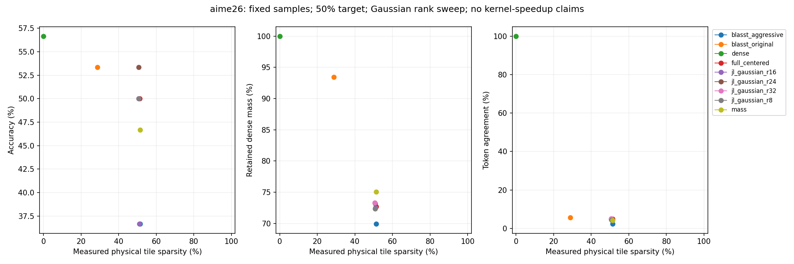
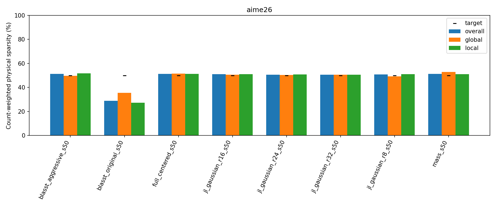

# AIME26 Gaussian projection dimensions8/16/24 versus32 and full-dimensional

Status: COMPLETE; 270/270 audited outputs.90 new final slots plus180 cached results; calibration and validation calls separately counted.

## Setup

All existing30 AIME26 questions,2048-token output budget, identical cached prompts and scorer, seed42, BF16 DiffusionGemma revision f7f5b7f5fa82ffc52addd066915886d497f5517b. Canvas256,max48 denoising steps,thinkingFalse; unchanged native0.4–0.8 schedule (temperature0 sentinel is not greedy).128-query×64-KV physical tiles; prefix+canvas eligible with native masks and GQA. All30, including the six calibration members, count in headline accuracy; noncalibration24 is additional. Previously examined samples, not fresh held-out confirmation. No LongBench final evaluation is run.

## Algorithms and calibration

All four Gaussian ranks use the same attention-weighted projected centered online-update criterion, fixed seed1729 and unchanged rank-dependent matrix generation/hash rules. The full-dimensional identity control is unchanged. No projection directions are selected using scores. Rank24 is enabled only through a process-local configuration allow-list; the existing padded FP32 GPU kernels, structural masks, first-support/tie retention, skipped-state convention, valid-KV RMS reference and original-V renormalized output are unchanged. Fresh CUDA tensor and actual-model trusted-reference checks validate ranks8/16/24. Two compatible native-dense16 smoke outputs are reused; sparse smoke is fresh.

Each new rank starts from the same prior full-budget Gaussian32 scalar thresholds as an unverified initial trial. The unchanged empirical-rank proposal/scalar fallback procedure verifies the same six AIME IDs at the full2048-token budget, for at most12 joint points. Acceptance requires physical overall/global/local sparsity within48–52%. Rank8/16 reuse historical calibration-state CDFs; rank24 computes its CDF from the same240 saved AIME states. Only sparsity, never accuracy, selects thresholds. Final policies freeze before final inference. Cached rank32/full/dense/originalBLASST/aggressiveBLASST/mass policies and outputs remain unchanged. No final retuning. Calibration IDs: aime26/2, aime26/8, aime26/14, aime26/20, aime26/23, aime26/30.

BLASST retains its exact-QK, row-max threshold convention and existing local/global inverse-length or scalar policies; original caps lambda at1 and aggressive permits larger values. Its physical tile skips only when all valid rows skip. Mass-only is the existing max-based candidate mass bound, not mass_exact. Compare actual physical sparsities and local/global allocations, not target labels.

## Results

aime26: dense 17/30. 

full_centered_s50: 15/30, actual sparsity 51.3% (global 51.4%, local 51.3%); dense accuracy delta -6.7 pp, paired 95% CI [-23.3, +13.3] pp.

jl_gaussian_r16_s50: 11/30, actual sparsity 51.0% (global 50.7%, local 51.1%); dense accuracy delta -20.0 pp, paired 95% CI [-36.7, -3.3] pp.

jl_gaussian_r24_s50: 16/30, actual sparsity 50.7% (global 50.3%, local 50.7%); dense accuracy delta -3.3 pp, paired 95% CI [-20.0, +13.3] pp.

jl_gaussian_r32_s50: 15/30, actual sparsity 50.7% (global 50.7%, local 50.7%); dense accuracy delta -6.7 pp, paired 95% CI [-26.7, +10.0] pp.

jl_gaussian_r8_s50: 15/30, actual sparsity 50.8% (global 49.3%, local 51.1%); dense accuracy delta -6.7 pp, paired 95% CI [-20.0, +6.7] pp.

6 nearest-point comparisons are not within3 percentage points in all overall/global/local sparsity measures; do not infer a matched-budget winner from those comparisons.

### full

| condition | threshold | score | accuracy | delta_pp | ci95_pp | whole | global_s | local_s | mass | agreement | local_operator_error | length_limited |
| --- | --- | --- | --- | --- | --- | --- | --- | --- | --- | --- | --- | --- |
| blasst_aggressive_s50 | local: exp(8.09133)/L; global: exp(7.77928)/L | 11/30 | 36.6667 | -20.0000 | [-36.666666666666664, -3.3333333333333335] | 51.3614 | 49.6095 | 51.7731 | 69.9423 | 2.4106 | 0.5001 | 6 |
| blasst_original_s50 | local: 1 (unattainable); global: 1 (unattainable) | 16/30 | 53.3333 | -3.3333 | [-20.0, 13.333333333333334] | 28.8187 | 35.4672 | 27.2322 | 93.4179 | 5.7355 | 0.1468 | 2 |
| dense | none / ranking budget | 17/30 | 56.6667 | 0.0000 | [0.0, 0.0] | 0.0000 | 0.0000 | 0.0000 | 100.0000 | 100.0000 | 0.0000 | 6 |
| full_centered_s50 | local: exp(-0.740297); global: exp(-1.21186) | 15/30 | 50.0000 | -6.6667 | [-23.333333333333332, 13.333333333333334] | 51.3059 | 51.4252 | 51.2764 | 72.6830 | 4.8750 | 0.2574 | 7 |
| jl_gaussian_r16_s50 | local: exp(-0.759528); global: exp(-1.23614) | 11/30 | 36.6667 | -20.0000 | [-36.666666666666664, -3.3333333333333335] | 51.0359 | 50.6811 | 51.1250 | 72.5367 | 4.7336 | 0.2621 | 8 |
| jl_gaussian_r24_s50 | local: exp(-0.759528); global: exp(-1.23614) | 16/30 | 53.3333 | -3.3333 | [-20.0, 13.333333333333334] | 50.6719 | 50.3491 | 50.7493 | 73.1916 | 4.7789 | 0.2526 | 5 |
| jl_gaussian_r32_s50 | local: exp(-0.759528); global: exp(-1.23614) | 15/30 | 50.0000 | -6.6667 | [-26.666666666666668, 10.0] | 50.6621 | 50.6697 | 50.6602 | 73.3096 | 5.1972 | 0.2527 | 5 |
| jl_gaussian_r8_s50 | local: exp(-0.759528); global: exp(-1.26821) | 15/30 | 50.0000 | -6.6667 | [-20.0, 6.666666666666667] | 50.7810 | 49.3227 | 51.1449 | 72.3521 | 4.3280 | 0.2664 | 6 |
| mass_s50 | local: exp(-0.0184422); global: exp(-0.04564) | 14/30 | 46.6667 | -10.0000 | [-23.333333333333332, 3.3333333333333335] | 51.3914 | 52.9351 | 51.0090 | 75.0530 | 4.2693 | 0.3014 | 8 |

### noncalibration24

| condition | threshold | score | accuracy | delta_pp | ci95_pp | whole | global_s | local_s | mass | agreement | local_operator_error | length_limited |
| --- | --- | --- | --- | --- | --- | --- | --- | --- | --- | --- | --- | --- |
| blasst_aggressive_s50 | local: exp(8.09133)/L; global: exp(7.77928)/L | 9/24 | 37.5000 | -20.8333 | [-41.66666666666667, 0.0] | 51.3468 | 49.6216 | 51.7528 | 70.3458 | 2.5868 | 0.4932 | 5 |
| blasst_original_s50 | local: 1 (unattainable); global: 1 (unattainable) | 13/24 | 54.1667 | -4.1667 | [-25.0, 16.666666666666664] | 28.9761 | 35.2079 | 27.4916 | 93.4145 | 6.0140 | 0.1471 | 2 |
| dense | none / ranking budget | 14/24 | 58.3333 | 0.0000 | [0.0, 0.0] | 0.0000 | 0.0000 | 0.0000 | 100.0000 | 100.0000 | 0.0000 | 5 |
| full_centered_s50 | local: exp(-0.740297); global: exp(-1.21186) | 12/24 | 50.0000 | -8.3333 | [-29.166666666666668, 16.666666666666664] | 51.4690 | 51.8490 | 51.3750 | 72.5994 | 5.0550 | 0.2566 | 5 |
| jl_gaussian_r16_s50 | local: exp(-0.759528); global: exp(-1.23614) | 9/24 | 37.5000 | -20.8333 | [-41.66666666666667, 0.0] | 51.0446 | 50.5084 | 51.1785 | 72.4809 | 4.6988 | 0.2616 | 5 |
| jl_gaussian_r24_s50 | local: exp(-0.759528); global: exp(-1.23614) | 14/24 | 58.3333 | 0.0000 | [-16.666666666666664, 16.666666666666664] | 50.7907 | 50.6287 | 50.8295 | 73.2865 | 4.8486 | 0.2499 | 4 |
| jl_gaussian_r32_s50 | local: exp(-0.759528); global: exp(-1.23614) | 12/24 | 50.0000 | -8.3333 | [-29.166666666666668, 12.5] | 50.7085 | 51.0653 | 50.6203 | 73.4097 | 4.7615 | 0.2503 | 4 |
| jl_gaussian_r8_s50 | local: exp(-0.759528); global: exp(-1.26821) | 13/24 | 54.1667 | -4.1667 | [-16.666666666666664, 8.333333333333332] | 50.8264 | 49.4029 | 51.1839 | 72.2483 | 4.4189 | 0.2666 | 5 |
| mass_s50 | local: exp(-0.0184422); global: exp(-0.04564) | 11/24 | 45.8333 | -12.5000 | [-29.166666666666668, 4.166666666666666] | 51.6113 | 53.1945 | 51.2174 | 74.9433 | 3.8060 | 0.3024 | 6 |

### calibration6

| condition | threshold | score | accuracy | delta_pp | ci95_pp | whole | global_s | local_s | mass | agreement | local_operator_error | length_limited |
| --- | --- | --- | --- | --- | --- | --- | --- | --- | --- | --- | --- | --- |
| blasst_aggressive_s50 | local: exp(8.09133)/L; global: exp(7.77928)/L | 2/6 | 33.3333 | -16.6667 | [-50.0, 0.0] | 51.4369 | 49.5463 | 51.8781 | 68.0513 | 1.7749 | 0.5307 | 1 |
| blasst_original_s50 | local: 1 (unattainable); global: 1 (unattainable) | 3/6 | 50.0000 | 0.0000 | [0.0, 0.0] | 28.2558 | 36.3890 | 26.3026 | 93.4299 | 4.7543 | 0.1460 | 0 |
| dense | none / ranking budget | 3/6 | 50.0000 | 0.0000 | [0.0, 0.0] | 0.0000 | 0.0000 | 0.0000 | 100.0000 | 100.0000 | 0.0000 | 1 |
| full_centered_s50 | local: exp(-0.740297); global: exp(-1.21186) | 3/6 | 50.0000 | 0.0000 | [0.0, 0.0] | 50.7106 | 49.8685 | 50.9173 | 72.9874 | 4.2374 | 0.2600 | 2 |
| jl_gaussian_r16_s50 | local: exp(-0.759528); global: exp(-1.23614) | 2/6 | 33.3333 | -16.6667 | [-50.0, 0.0] | 51.0102 | 51.1809 | 50.9667 | 72.7032 | 4.8503 | 0.2636 | 3 |
| jl_gaussian_r24_s50 | local: exp(-0.759528); global: exp(-1.23614) | 2/6 | 33.3333 | -16.6667 | [-66.66666666666666, 33.33333333333333] | 50.2803 | 49.4284 | 50.4848 | 72.8789 | 4.5455 | 0.2612 | 1 |
| jl_gaussian_r32_s50 | local: exp(-0.759528); global: exp(-1.23614) | 3/6 | 50.0000 | 0.0000 | [0.0, 0.0] | 50.4950 | 49.2175 | 50.8033 | 72.9448 | 6.7698 | 0.2612 | 1 |
| jl_gaussian_r8_s50 | local: exp(-0.759528); global: exp(-1.26821) | 2/6 | 33.3333 | -16.6667 | [-50.0, 0.0] | 50.6012 | 48.9974 | 50.9915 | 72.7494 | 3.9933 | 0.2655 | 1 |
| mass_s50 | local: exp(-0.0184422); global: exp(-0.04564) | 3/6 | 50.0000 | 0.0000 | [0.0, 0.0] | 50.5555 | 51.9324 | 50.2199 | 75.4630 | 5.9010 | 0.2977 | 2 |

## Measurements and limitations

Physical sparsity is SUM(skipped eligible tiles)/SUM(eligible tiles), reported overall/global/local and by layer/head/step/region. Dense prefill is excluded. Retained mass and full-dimensional local operator error use dense attention on each execution's corresponding QKV, separately from generated-token divergence. Shared-QKV diagnostics use identical historical early calibration states (32 selected states from240); they do not exhaust all final generation states. No end-to-end projection-seed sensitivity claim is made.

Token agreement counts positional matches over all generated positions after divergence; missing/extra positions disagree and EOS is included. Paired prompt bootstrap95% intervals condition on fixed policies/seeds, are exploratory and not multiplicity-corrected. Small differences on30 reused questions may be inconclusive. Changing rank also changes the deterministic random matrix; this is one fixed-seed dimension study, not an average over directions.

QK, block softmax and projected PV remain computed; full-dimensional PV is diagnostic-only for projected routing. Retained native PV is still a dense-shaped masked matmul. Work-accounting exports sketch projection/storage/refresh/reuse; no hardware-speedup or FlashAttention claim.

Missing=0; violations=0. Failures are preserved and independent ranks continue. Regenerate without inference: `CUDA_VISIBLE_DEVICES='' PYTHONPATH=src:. python -m experiments.diffusion_gemma_jl_aime_dimensions report`; independently repeat with `verify`.
