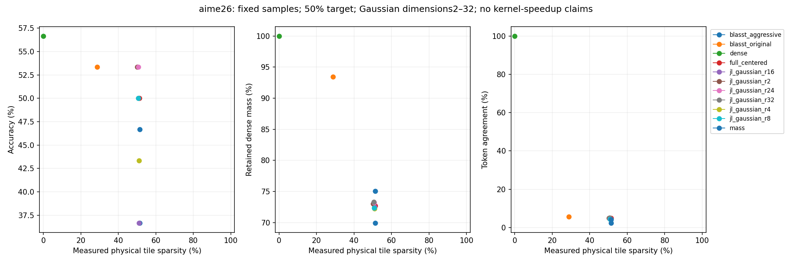
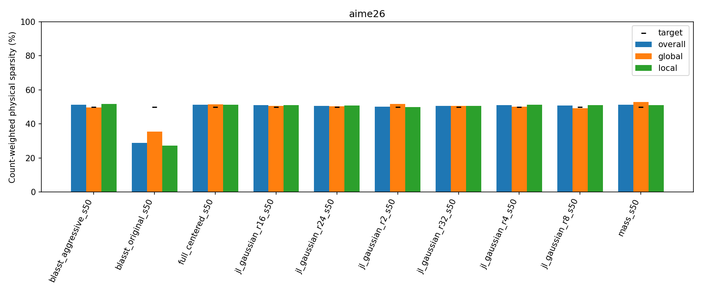

# AIME26 Gaussian dimensions2/4 versus8/16/24/32 and full-dimensional

Status: COMPLETE; 330/330 audited outputs.60 new final slots and270 reused comparisons.

## Setup and calibration

Unchanged30 AIME26 questions,2048-token budget, prompts/scorer, seed42, BF16 model revision f7f5b7f5fa82ffc52addd066915886d497f5517b. Canvas256,up to48 denoising steps,thinkingFalse and native0.4–0.8 schedule (temperature0 sentinel is not greedy).128-query×64-KV physical tiles; prefix+canvas eligible with native masks and GQA. Gaussian centered routing uses FP32 sketches/state, seed1729 and unchanged rank-dependent matrix/hash construction. Only a scoped configuration allow-list is extended; existing generic kernels, first-support/tie handling and original-V renormalized output are unchanged.

Each new rank starts from the same unverified Gaussian32 scalar trial, with its own empirical CDF from240 saved calibration QKV states. The existing local/global rank-proposal/scalar fallback checks the same six questions at2048 tokens, max12 joint points, requiring overall/global/local48–52%. Only sparsity selects thresholds, never accuracy. All new policies freeze before final inference. The six calibration questions are included in headline30; noncalibration24 is separately reported and was previously examined, not fresh held-out confirmation. IDs: aime26/2, aime26/8, aime26/14, aime26/20, aime26/23, aime26/30.

All270 predecessor outputs/policies and256 shared-state diagnostics are reused unchanged in numerical content. New dimensions receive CPU/CUDA tests and fresh unpruned-native/pruned-trusted generation checks on two inputs. Two compatible native smoke outputs are reused. Failures are preserved; independent ranks continue.

## Results

aime26: dense 17/30. 

full_centered_s50: 15/30, actual sparsity 51.3% (global 51.4%, local 51.3%); dense accuracy delta -6.7 pp, paired 95% CI [-23.3, +13.3] pp.

jl_gaussian_r16_s50: 11/30, actual sparsity 51.0% (global 50.7%, local 51.1%); dense accuracy delta -20.0 pp, paired 95% CI [-36.7, -3.3] pp.

jl_gaussian_r24_s50: 16/30, actual sparsity 50.7% (global 50.3%, local 50.7%); dense accuracy delta -3.3 pp, paired 95% CI [-20.0, +13.3] pp.

jl_gaussian_r2_s50: 16/30, actual sparsity 50.2% (global 51.6%, local 49.8%); dense accuracy delta -3.3 pp, paired 95% CI [-20.0, +13.3] pp.

jl_gaussian_r32_s50: 15/30, actual sparsity 50.7% (global 50.7%, local 50.7%); dense accuracy delta -6.7 pp, paired 95% CI [-26.7, +10.0] pp.

jl_gaussian_r4_s50: 13/30, actual sparsity 51.0% (global 50.2%, local 51.2%); dense accuracy delta -13.3 pp, paired 95% CI [-30.0, +0.0] pp.

jl_gaussian_r8_s50: 15/30, actual sparsity 50.8% (global 49.3%, local 51.1%); dense accuracy delta -6.7 pp, paired 95% CI [-20.0, +6.7] pp.

8 nearest-point comparisons are not within3 percentage points in all overall/global/local sparsity measures; do not infer a matched-budget winner from those comparisons.

### full

| split | condition | threshold | correct | count | accuracy | delta_pp | ci95_pp | whole | global_s | local_s | mass | agreement | local_operator_error |
| --- | --- | --- | --- | --- | --- | --- | --- | --- | --- | --- | --- | --- | --- |
| full | blasst_aggressive_s50 | local: exp(8.09133)/L; global: exp(7.77928)/L | 11.0000 | 30 | 36.6667 | -20.0000 | [-36.666666666666664, -3.3333333333333335] | 51.3614 | 49.6095 | 51.7731 | 69.9423 | 2.4106 | 0.5001 |
| full | blasst_original_s50 | local: 1 (unattainable); global: 1 (unattainable) | 16.0000 | 30 | 53.3333 | -3.3333 | [-20.0, 13.333333333333334] | 28.8187 | 35.4672 | 27.2322 | 93.4179 | 5.7355 | 0.1468 |
| full | dense | none / ranking budget | 17.0000 | 30 | 56.6667 | 0.0000 | [0.0, 0.0] | 0.0000 | 0.0000 | 0.0000 | 100.0000 | 100.0000 | 0.0000 |
| full | full_centered_s50 | local: exp(-0.740297); global: exp(-1.21186) | 15.0000 | 30 | 50.0000 | -6.6667 | [-23.333333333333332, 13.333333333333334] | 51.3059 | 51.4252 | 51.2764 | 72.6830 | 4.8750 | 0.2574 |
| full | jl_gaussian_r16_s50 | local: exp(-0.759528); global: exp(-1.23614) | 11.0000 | 30 | 36.6667 | -20.0000 | [-36.666666666666664, -3.3333333333333335] | 51.0359 | 50.6811 | 51.1250 | 72.5367 | 4.7336 | 0.2621 |
| full | jl_gaussian_r24_s50 | local: exp(-0.759528); global: exp(-1.23614) | 16.0000 | 30 | 53.3333 | -3.3333 | [-20.0, 13.333333333333334] | 50.6719 | 50.3491 | 50.7493 | 73.1916 | 4.7789 | 0.2526 |
| full | jl_gaussian_r2_s50 | local: exp(-0.855113); global: exp(-1.26686) | 16.0000 | 30 | 53.3333 | -3.3333 | [-20.0, 13.333333333333334] | 50.2052 | 51.6311 | 49.8471 | 73.0259 | 4.8962 | 0.2808 |
| full | jl_gaussian_r32_s50 | local: exp(-0.759528); global: exp(-1.23614) | 15.0000 | 30 | 50.0000 | -6.6667 | [-26.666666666666668, 10.0] | 50.6621 | 50.6697 | 50.6602 | 73.3096 | 5.1972 | 0.2527 |
| full | jl_gaussian_r4_s50 | local: exp(-0.759528); global: exp(-1.23614) | 13.0000 | 30 | 43.3333 | -13.3333 | [-30.0, 0.0] | 51.0165 | 50.2353 | 51.2063 | 72.2207 | 4.4689 | 0.2722 |
| full | jl_gaussian_r8_s50 | local: exp(-0.759528); global: exp(-1.26821) | 15.0000 | 30 | 50.0000 | -6.6667 | [-20.0, 6.666666666666667] | 50.7810 | 49.3227 | 51.1449 | 72.3521 | 4.3280 | 0.2664 |
| full | mass_s50 | local: exp(-0.0184422); global: exp(-0.04564) | 14.0000 | 30 | 46.6667 | -10.0000 | [-23.333333333333332, 3.3333333333333335] | 51.3914 | 52.9351 | 51.0090 | 75.0530 | 4.2693 | 0.3014 |

### noncalibration24

| split | condition | threshold | correct | count | accuracy | delta_pp | ci95_pp | whole | global_s | local_s | mass | agreement | local_operator_error |
| --- | --- | --- | --- | --- | --- | --- | --- | --- | --- | --- | --- | --- | --- |
| noncalibration24 | blasst_aggressive_s50 | local: exp(8.09133)/L; global: exp(7.77928)/L | 9.0000 | 24 | 37.5000 | -20.8333 | [-41.66666666666667, 0.0] | 51.3468 | 49.6216 | 51.7528 | 70.3458 | 2.5868 | 0.4932 |
| noncalibration24 | blasst_original_s50 | local: 1 (unattainable); global: 1 (unattainable) | 13.0000 | 24 | 54.1667 | -4.1667 | [-25.0, 16.666666666666664] | 28.9761 | 35.2079 | 27.4916 | 93.4145 | 6.0140 | 0.1471 |
| noncalibration24 | dense | none / ranking budget | 14.0000 | 24 | 58.3333 | 0.0000 | [0.0, 0.0] | 0.0000 | 0.0000 | 0.0000 | 100.0000 | 100.0000 | 0.0000 |
| noncalibration24 | full_centered_s50 | local: exp(-0.740297); global: exp(-1.21186) | 12.0000 | 24 | 50.0000 | -8.3333 | [-29.166666666666668, 16.666666666666664] | 51.4690 | 51.8490 | 51.3750 | 72.5994 | 5.0550 | 0.2566 |
| noncalibration24 | jl_gaussian_r16_s50 | local: exp(-0.759528); global: exp(-1.23614) | 9.0000 | 24 | 37.5000 | -20.8333 | [-41.66666666666667, 0.0] | 51.0446 | 50.5084 | 51.1785 | 72.4809 | 4.6988 | 0.2616 |
| noncalibration24 | jl_gaussian_r24_s50 | local: exp(-0.759528); global: exp(-1.23614) | 14.0000 | 24 | 58.3333 | 0.0000 | [-16.666666666666664, 16.666666666666664] | 50.7907 | 50.6287 | 50.8295 | 73.2865 | 4.8486 | 0.2499 |
| noncalibration24 | jl_gaussian_r2_s50 | local: exp(-0.855113); global: exp(-1.26686) | 13.0000 | 24 | 54.1667 | -4.1667 | [-25.0, 16.666666666666664] | 50.2899 | 51.7818 | 49.9166 | 72.9160 | 4.7718 | 0.2805 |
| noncalibration24 | jl_gaussian_r32_s50 | local: exp(-0.759528); global: exp(-1.23614) | 12.0000 | 24 | 50.0000 | -8.3333 | [-29.166666666666668, 12.5] | 50.7085 | 51.0653 | 50.6203 | 73.4097 | 4.7615 | 0.2503 |
| noncalibration24 | jl_gaussian_r4_s50 | local: exp(-0.759528); global: exp(-1.23614) | 11.0000 | 24 | 45.8333 | -12.5000 | [-29.166666666666668, 4.166666666666666] | 51.1704 | 50.4091 | 51.3548 | 72.1046 | 4.6195 | 0.2714 |
| noncalibration24 | jl_gaussian_r8_s50 | local: exp(-0.759528); global: exp(-1.26821) | 13.0000 | 24 | 54.1667 | -4.1667 | [-16.666666666666664, 8.333333333333332] | 50.8264 | 49.4029 | 51.1839 | 72.2483 | 4.4189 | 0.2666 |
| noncalibration24 | mass_s50 | local: exp(-0.0184422); global: exp(-0.04564) | 11.0000 | 24 | 45.8333 | -12.5000 | [-29.166666666666668, 4.166666666666666] | 51.6113 | 53.1945 | 51.2174 | 74.9433 | 3.8060 | 0.3024 |

### calibration6

| split | condition | threshold | correct | count | accuracy | delta_pp | ci95_pp | whole | global_s | local_s | mass | agreement | local_operator_error |
| --- | --- | --- | --- | --- | --- | --- | --- | --- | --- | --- | --- | --- | --- |
| calibration6 | blasst_aggressive_s50 | local: exp(8.09133)/L; global: exp(7.77928)/L | 2.0000 | 6 | 33.3333 | -16.6667 | [-50.0, 0.0] | 51.4369 | 49.5463 | 51.8781 | 68.0513 | 1.7749 | 0.5307 |
| calibration6 | blasst_original_s50 | local: 1 (unattainable); global: 1 (unattainable) | 3.0000 | 6 | 50.0000 | 0.0000 | [0.0, 0.0] | 28.2558 | 36.3890 | 26.3026 | 93.4299 | 4.7543 | 0.1460 |
| calibration6 | dense | none / ranking budget | 3.0000 | 6 | 50.0000 | 0.0000 | [0.0, 0.0] | 0.0000 | 0.0000 | 0.0000 | 100.0000 | 100.0000 | 0.0000 |
| calibration6 | full_centered_s50 | local: exp(-0.740297); global: exp(-1.21186) | 3.0000 | 6 | 50.0000 | 0.0000 | [0.0, 0.0] | 50.7106 | 49.8685 | 50.9173 | 72.9874 | 4.2374 | 0.2600 |
| calibration6 | jl_gaussian_r16_s50 | local: exp(-0.759528); global: exp(-1.23614) | 2.0000 | 6 | 33.3333 | -16.6667 | [-50.0, 0.0] | 51.0102 | 51.1809 | 50.9667 | 72.7032 | 4.8503 | 0.2636 |
| calibration6 | jl_gaussian_r24_s50 | local: exp(-0.759528); global: exp(-1.23614) | 2.0000 | 6 | 33.3333 | -16.6667 | [-66.66666666666666, 33.33333333333333] | 50.2803 | 49.4284 | 50.4848 | 72.8789 | 4.5455 | 0.2612 |
| calibration6 | jl_gaussian_r2_s50 | local: exp(-0.855113); global: exp(-1.26686) | 3.0000 | 6 | 50.0000 | 0.0000 | [0.0, 0.0] | 49.9440 | 51.1716 | 49.6323 | 73.3695 | 5.3336 | 0.2819 |
| calibration6 | jl_gaussian_r32_s50 | local: exp(-0.759528); global: exp(-1.23614) | 3.0000 | 6 | 50.0000 | 0.0000 | [0.0, 0.0] | 50.4950 | 49.2175 | 50.8033 | 72.9448 | 6.7698 | 0.2612 |
| calibration6 | jl_gaussian_r4_s50 | local: exp(-0.759528); global: exp(-1.23614) | 2.0000 | 6 | 33.3333 | -16.6667 | [-50.0, 0.0] | 50.5042 | 49.6628 | 50.7107 | 72.6063 | 3.9512 | 0.2747 |
| calibration6 | jl_gaussian_r8_s50 | local: exp(-0.759528); global: exp(-1.26821) | 2.0000 | 6 | 33.3333 | -16.6667 | [-50.0, 0.0] | 50.6012 | 48.9974 | 50.9915 | 72.7494 | 3.9933 | 0.2655 |
| calibration6 | mass_s50 | local: exp(-0.0184422); global: exp(-0.04564) | 3.0000 | 6 | 50.0000 | 0.0000 | [0.0, 0.0] | 50.5555 | 51.9324 | 50.2199 | 75.4630 | 5.9010 | 0.2977 |

## Metrics and limitations

Physical sparsity is SUM(skipped eligible tiles)/SUM(eligible tiles), not an average of percentages; dense prefill excluded. Retained mass and local operator error use dense attention on each execution's QKV, not cached dense-generation QKV after divergence. Shared-QKV diagnostics separately use32 selected early calibration states per method, one selected head/query tile per state; error is sqrt(SUM(error squared)/SUM(dense output squared)). Token agreement includes positions after divergence and treats missing/extra tokens as disagreements, including EOS. Raw per-layer/head/step/region counts, sketch work and projection hashes are exported.

Original/aggressive BLASST, mass-only and all previous directional policies remain unchanged. Original BLASST caps lambda at1 and cannot attain50% here; its lower actual sparsity is not matched. Mass-only is the existing max-based mass bound. Compare actual whole/global/local sparsity rather than target labels.

One fixed projection seed; rank changes also change random directions. No seed robustness or monotonic dimension claim follows. Paired prompt-bootstrap95% intervals condition on policies/seeds, are exploratory and not multiplicity-corrected. QK, block softmax and projected PV are still computed; full PV is diagnostic-only for sketch routing. Retained native PV remains a masked dense-shaped matmul. No hardware-speedup claim.

## New ranks versus existing dimensions

| candidate | reference | candidate_correct | reference_correct | delta_pp | paired_ci95_pp | overall_sparsity_gap_pp | global_sparsity_gap_pp | local_sparsity_gap_pp | within2pp_all_types |
| --- | --- | --- | --- | --- | --- | --- | --- | --- | --- |
| jl_gaussian_r2_s50 | jl_gaussian_r8_s50 | 16.0000 | 15.0000 | 3.3333 | [-10.0, 16.666666666666664] | -0.5758 | 2.3083 | -1.2978 | False |
| jl_gaussian_r2_s50 | jl_gaussian_r16_s50 | 16.0000 | 11.0000 | 16.6667 | [-3.3333333333333335, 36.666666666666664] | -0.8307 | 0.9500 | -1.2779 | True |
| jl_gaussian_r2_s50 | jl_gaussian_r24_s50 | 16.0000 | 16.0000 | 0.0000 | [-16.666666666666664, 16.666666666666664] | -0.4668 | 1.2819 | -0.9022 | True |
| jl_gaussian_r2_s50 | jl_gaussian_r32_s50 | 16.0000 | 15.0000 | 3.3333 | [-16.666666666666664, 23.333333333333332] | -0.4569 | 0.9614 | -0.8131 | True |
| jl_gaussian_r2_s50 | full_centered_s50 | 16.0000 | 15.0000 | 3.3333 | [-10.0, 16.666666666666664] | -1.1007 | 0.2059 | -1.4293 | True |
| jl_gaussian_r4_s50 | jl_gaussian_r8_s50 | 13.0000 | 15.0000 | -6.6667 | [-23.333333333333332, 10.0] | 0.2355 | 0.9125 | 0.0614 | True |
| jl_gaussian_r4_s50 | jl_gaussian_r16_s50 | 13.0000 | 11.0000 | 6.6667 | [-13.333333333333334, 26.666666666666668] | -0.0194 | -0.4458 | 0.0814 | True |
| jl_gaussian_r4_s50 | jl_gaussian_r24_s50 | 13.0000 | 16.0000 | -10.0000 | [-26.666666666666668, 6.666666666666667] | 0.3446 | -0.1139 | 0.4570 | True |
| jl_gaussian_r4_s50 | jl_gaussian_r32_s50 | 13.0000 | 15.0000 | -6.6667 | [-26.666666666666668, 13.333333333333334] | 0.3545 | -0.4344 | 0.5461 | True |
| jl_gaussian_r4_s50 | full_centered_s50 | 13.0000 | 15.0000 | -6.6667 | [-23.333333333333332, 10.0] | -0.2894 | -1.1899 | -0.0701 | True |

Missing=0; violations=0. Raw-only regeneration: `python -m experiments.diffusion_gemma_jl_aime_tiny_dimensions report`; independently repeat with `verify`.
