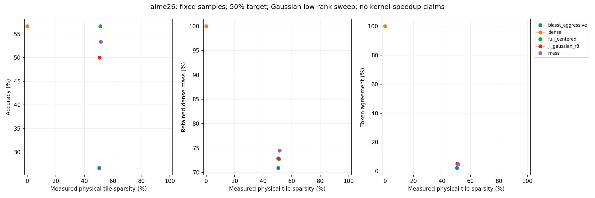

# AIME26 generation-seed43 replication

Status: COMPLETE; 150/150 audited outputs.

Same30 AIME26 questions and2048-token output budgets, pinned BF16 DiffusionGemma revision f7f5b7f5fa82ffc52addd066915886d497f5517b. Generation seed43 instead of42 for every condition; projection seed1729 and all Gaussian8 matrices unchanged. Native0.4–0.8 sampling schedule, canvas256, max48 denoising steps, thinkingFalse; temperature0 sentinel is NOT greedy.128-query×64-KV tiles, prefix+canvas eligible, native masks and GQA.

All150 final outputs are fresh and paired against the new seed43 dense outputs. No seed42 outputs are substituted. Exact previous seed42-calibrated local/global policies are frozen without refitting; achieved sparsity can drift. Aggressive BLASST retains its existing lambda/length rule allowing lambda>1. Mass is the existing max-based mass bound. Full and Gaussian8 use unchanged attention-weighted centered updates, first-support/tie retention and ordinary retained attention renormalization.

## Seed43 results

### full

| split | condition | threshold | correct | count | accuracy | delta_pp | ci95_pp | whole | global_s | local_s | mass | agreement | local_operator_error |
| --- | --- | --- | --- | --- | --- | --- | --- | --- | --- | --- | --- | --- | --- |
| full | blasst_aggressive_s50 | local: exp(8.09133)/L; global: exp(7.77928)/L | 8.0000 | 30 | 26.6667 | -30.0000 | [-50.0, -13.333333333333334] | 50.4636 | 49.2867 | 50.7526 | 70.9386 | 2.2977 | 0.4786 |
| full | dense | none / ranking budget | 17.0000 | 30 | 56.6667 | 0.0000 | [0.0, 0.0] | 0.0000 | 0.0000 | 0.0000 | 100.0000 | 100.0000 | 0.0000 |
| full | full_centered_s50 | local: exp(-0.740297); global: exp(-1.21186) | 17.0000 | 30 | 56.6667 | 0.0000 | [-16.666666666666664, 16.666666666666664] | 51.1085 | 50.9032 | 51.1588 | 72.7767 | 4.9069 | 0.2580 |
| full | jl_gaussian_r8_s50 | local: exp(-0.759528); global: exp(-1.26821) | 15.0000 | 30 | 50.0000 | -6.6667 | [-23.333333333333332, 10.0] | 50.5899 | 48.8536 | 51.0159 | 72.8806 | 5.0864 | 0.2652 |
| full | mass_s50 | local: exp(-0.0184422); global: exp(-0.04564) | 16.0000 | 30 | 53.3333 | -3.3333 | [-16.666666666666664, 10.0] | 51.4829 | 53.1811 | 51.0683 | 74.5225 | 4.7585 | 0.3063 |

### noncalibration24

| split | condition | threshold | correct | count | accuracy | delta_pp | ci95_pp | whole | global_s | local_s | mass | agreement | local_operator_error |
| --- | --- | --- | --- | --- | --- | --- | --- | --- | --- | --- | --- | --- | --- |
| noncalibration24 | blasst_aggressive_s50 | local: exp(8.09133)/L; global: exp(7.77928)/L | 6.0000 | 24 | 25.0000 | -33.3333 | [-54.166666666666664, -12.5] | 49.7657 | 47.7404 | 50.2659 | 71.6373 | 2.2737 | 0.4668 |
| noncalibration24 | dense | none / ranking budget | 14.0000 | 24 | 58.3333 | 0.0000 | [0.0, 0.0] | 0.0000 | 0.0000 | 0.0000 | 100.0000 | 100.0000 | 0.0000 |
| noncalibration24 | full_centered_s50 | local: exp(-0.740297); global: exp(-1.21186) | 13.0000 | 24 | 54.1667 | -4.1667 | [-20.833333333333336, 12.5] | 51.3074 | 51.5134 | 51.2564 | 72.4757 | 5.0960 | 0.2579 |
| noncalibration24 | jl_gaussian_r8_s50 | local: exp(-0.759528); global: exp(-1.26821) | 12.0000 | 24 | 50.0000 | -8.3333 | [-29.166666666666668, 12.5] | 50.6094 | 49.1512 | 50.9699 | 72.9332 | 5.2325 | 0.2645 |
| noncalibration24 | mass_s50 | local: exp(-0.0184422); global: exp(-0.04564) | 14.0000 | 24 | 58.3333 | 0.0000 | [-16.666666666666664, 16.666666666666664] | 51.6675 | 53.3972 | 51.2449 | 74.3529 | 4.5251 | 0.3070 |

### calibration6

| split | condition | threshold | correct | count | accuracy | delta_pp | ci95_pp | whole | global_s | local_s | mass | agreement | local_operator_error |
| --- | --- | --- | --- | --- | --- | --- | --- | --- | --- | --- | --- | --- | --- |
| calibration6 | blasst_aggressive_s50 | local: exp(8.09133)/L; global: exp(7.77928)/L | 2.0000 | 6 | 33.3333 | -16.6667 | [-50.0, 0.0] | 53.1726 | 55.4258 | 52.6314 | 68.3237 | 2.3814 | 0.5168 |
| calibration6 | dense | none / ranking budget | 3.0000 | 6 | 50.0000 | 0.0000 | [0.0, 0.0] | 0.0000 | 0.0000 | 0.0000 | 100.0000 | 100.0000 | 0.0000 |
| calibration6 | full_centered_s50 | local: exp(-0.740297); global: exp(-1.21186) | 4.0000 | 6 | 66.6667 | 16.6667 | [0.0, 50.0] | 50.3459 | 48.4614 | 50.7888 | 73.8711 | 4.2549 | 0.2586 |
| calibration6 | jl_gaussian_r8_s50 | local: exp(-0.759528); global: exp(-1.26821) | 3.0000 | 6 | 50.0000 | 0.0000 | [0.0, 0.0] | 50.5156 | 47.6812 | 51.1905 | 72.6826 | 4.6046 | 0.2679 |
| calibration6 | mass_s50 | local: exp(-0.0184422); global: exp(-0.04564) | 2.0000 | 6 | 33.3333 | -16.6667 | [-50.0, 0.0] | 50.7106 | 52.2743 | 50.3302 | 75.2092 | 5.5826 | 0.3035 |

## Seed43 minus seed42, paired by question

| condition | count | seed42_correct | seed43_correct | delta_pp | paired_ci95_pp |
| --- | --- | --- | --- | --- | --- |
| dense | 30 | 17.0000 | 17.0000 | 0.0000 | [-20.0, 16.666666666666664] |
| blasst_aggressive_s50 | 30 | 11.0000 | 8.0000 | -10.0000 | [-23.333333333333332, 3.3333333333333335] |
| mass_s50 | 30 | 14.0000 | 16.0000 | 6.6667 | [-10.0, 26.666666666666668] |
| full_centered_s50 | 30 | 15.0000 | 17.0000 | 6.6667 | [-6.666666666666667, 20.0] |
| jl_gaussian_r8_s50 | 30 | 15.0000 | 15.0000 | 0.0000 | [-16.666666666666664, 16.666666666666664] |

## Metrics and limitations

Physical sparsity is SUM(skipped eligible tiles)/SUM(eligible tiles), with whole/global/local counts, excluding dense prefill. Retained mass and full-dimensional local output error use dense attention on each run's corresponding QKV. Shared-QKV diagnostics are reused from32 selected early seed42 states per method; they are not new seed43 trajectory diagnostics. Execution-local measurements are fresh. Token agreement uses the seed43 dense sequence, all positions including after divergence and EOS, with missing/extra positions disagreeing.

Six historically calibrated questions remain in headline30; noncalibration24 is separately reported. All examples were previously examined. Two generation seeds with one fixed projection seed are a sensitivity check, not broad seed robustness or fresh held-out confirmation. Paired prompt-bootstrap95% intervals are exploratory and not multiplicity-corrected. Compare actual sparsity, not target labels. No policy or seed selection using these scores.

Numerical kernels and routing algorithms are unchanged. Existing CPU/CUDA evidence is reused, plus fresh seed43 native/unpruned and trusted/pruned rank8 checks on two inputs before evaluation. QK, block softmax and projected PV are still computed; retained native PV is a masked dense-shaped matmul. Projection/cache overhead is recorded; no FlashAttention or hardware-speedup claim.

Missing=0; violations=0. Raw-only reproduction: `python -m experiments.diffusion_gemma_jl_aime_seed43 report`, then `verify`.
