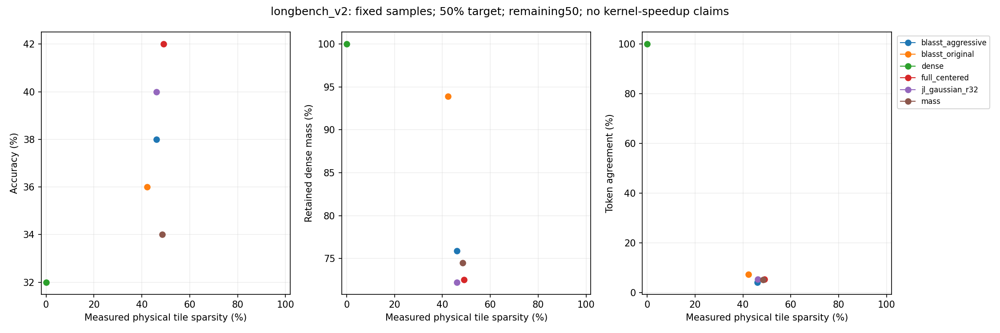
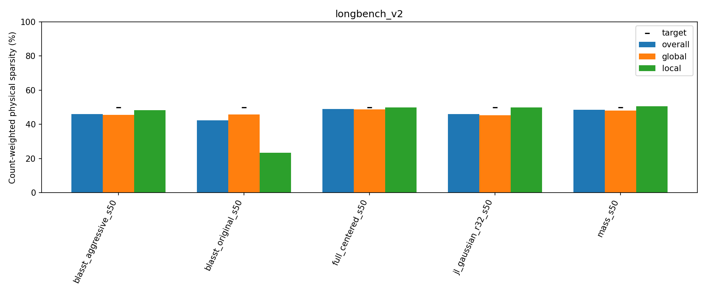

# Frozen50%-target routing on the remaining50 LongBench v2 questions

Status: COMPLETE; 300/300 audited outputs.100 new directional generations;200 exact cached dense/BLASST/mass results.

## Setup and threshold provenance

The exact other50 IDs from the preceding100-question NeMo study are selected without examining scores; no overlap in IDs or prompt hashes with the previous50 or relevant calibration/development sets. All50 count in headline accuracy. These samples already have baseline exposure and methods were chosen after previous results; this is not fresh fully held-out confirmation.

| domain | count |
| --- | --- |
| Code Repository Understanding | 5 |
| Long In-context Learning | 8 |
| Long Structured Data Understanding | 3 |
| Long-dialogue History Understanding | 4 |
| Multi-Document QA | 12 |
| Single-Document QA | 18 |

BF16 DiffusionGemma revision f7f5b7f5fa82ffc52addd066915886d497f5517b; unchanged cached NeMo prompts/MCQ scorer,4096-token generation budget,32K input cap, seed42, canvas256,max48 denoising steps,thinkingFalse. The native0.4–0.8 schedule is unchanged; temperature0 is a sentinel, not greedy. 42/50 source prompts retain inherited truncation.

Full-dimensional centered and Gaussian32 centered use the exact preceding full-budget calibrated local/global scalar thresholds. No recalibration, new seed selection or threshold changes are allowed. Gaussian32 seed1729 and per-layer/native-KV-head matrix hashes remain fixed. Both use128-query×64-KV physical tiles, prefix+canvas eligibility, native structural masks/GQA, attention-weighted centered online updates, valid-KV RMS reference scaling, worst-valid-query gating, retained ties/first support, unchanged state on skip and original-V renormalization without compensation.

Dense and original/aggressive BLASST and mass-only outputs are imported from the completed100-question cache only after exact prompt/budget/seed/config/threshold and decoding checks. BLASST uses exact token-QK block maxima and physical skip only when every valid query votes skip. Original lambda is capped at1; aggressive lambda may exceed1 with the preceding-seen-maximum convention. Existing lambda=exp(log_scale)/valid_KV_length or scalar exp(log_threshold) rules and unattainable-boundary flags are unchanged. Mass-only remains the existing max-based candidate-mass bound, not mass_exact. thresholds.json preserves exact policy provenance.

## Remaining50 results

longbench_v2: dense 16/50. 

full_centered_s50: 21/50, actual sparsity 49.0% (global 48.8%, local 50.0%); dense accuracy delta +10.0 pp, paired 95% CI [+0.0, +20.0] pp.

jl_gaussian_r32_s50: 20/50, actual sparsity 46.1% (global 45.4%, local 50.0%); dense accuracy delta +8.0 pp, paired 95% CI [-2.0, +20.0] pp.

4 nearest-point comparisons are not within3 percentage points in all overall/global/local sparsity measures; do not infer a matched-budget winner from those comparisons.

| condition | threshold | score | accuracy | delta_pp | ci95_pp | whole | global_s | local_s | mass | agreement | local_operator_error | unparsed | length_limited |
| --- | --- | --- | --- | --- | --- | --- | --- | --- | --- | --- | --- | --- | --- |
| blasst_aggressive_s50 | local: exp(8.37258)/L; global: exp(8.36106)/L | 19/50 | 38.0000 | 6.0000 | [-2.0, 16.0] | 46.0475 | 45.6294 | 48.2295 | 75.8926 | 4.2134 | 0.3396 | 3 | 0 |
| blasst_original_s50 | local: exp(0); global: min(1, exp(8.36106)/L) | 18/50 | 36.0000 | 4.0000 | [0.0, 10.0] | 42.2738 | 45.8631 | 23.2729 | 93.9186 | 7.4145 | 0.1292 | 3 | 0 |
| dense | none / ranking budget | 16/50 | 32.0000 | 0.0000 | [0.0, 0.0] | 0.0000 | 0.0000 | 0.0000 | 100.0000 | 100.0000 | 0.0000 | 2 | 0 |
| full_centered_s50 | local: exp(-0.731019); global: exp(-5.01796) | 21/50 | 42.0000 | 10.0000 | [0.0, 20.0] | 49.0267 | 48.8379 | 50.0089 | 72.4974 | 5.3563 | 0.2768 | 4 | 0 |
| jl_gaussian_r32_s50 | local: exp(-0.72214); global: exp(-5.16173) | 20/50 | 40.0000 | 8.0000 | [-2.0, 20.0] | 46.1320 | 45.3826 | 50.0226 | 72.2216 | 5.4320 | 0.2822 | 2 | 0 |
| mass_s50 | local: exp(-0.0152636); global: exp(-1.3682) | 17/50 | 34.0000 | 2.0000 | [-8.0, 12.0] | 48.4990 | 48.0930 | 50.6403 | 74.4709 | 5.1772 | 0.3166 | 7 | 0 |

## Domain results

| domain | condition | score | accuracy |
| --- | --- | --- | --- |
| Code Repository Understanding | blasst_aggressive_s50 | 2/5 | 40.0000 |
| Code Repository Understanding | blasst_original_s50 | 2/5 | 40.0000 |
| Code Repository Understanding | dense | 2/5 | 40.0000 |
| Code Repository Understanding | full_centered_s50 | 2/5 | 40.0000 |
| Code Repository Understanding | jl_gaussian_r32_s50 | 2/5 | 40.0000 |
| Code Repository Understanding | mass_s50 | 1/5 | 20.0000 |
| Long In-context Learning | blasst_aggressive_s50 | 4/8 | 50.0000 |
| Long In-context Learning | blasst_original_s50 | 4/8 | 50.0000 |
| Long In-context Learning | dense | 4/8 | 50.0000 |
| Long In-context Learning | full_centered_s50 | 4/8 | 50.0000 |
| Long In-context Learning | jl_gaussian_r32_s50 | 4/8 | 50.0000 |
| Long In-context Learning | mass_s50 | 3/8 | 37.5000 |
| Long Structured Data Understanding | blasst_aggressive_s50 | 0/3 | 0.0000 |
| Long Structured Data Understanding | blasst_original_s50 | 0/3 | 0.0000 |
| Long Structured Data Understanding | dense | 0/3 | 0.0000 |
| Long Structured Data Understanding | full_centered_s50 | 0/3 | 0.0000 |
| Long Structured Data Understanding | jl_gaussian_r32_s50 | 0/3 | 0.0000 |
| Long Structured Data Understanding | mass_s50 | 0/3 | 0.0000 |
| Long-dialogue History Understanding | blasst_aggressive_s50 | 1/4 | 25.0000 |
| Long-dialogue History Understanding | blasst_original_s50 | 0/4 | 0.0000 |
| Long-dialogue History Understanding | dense | 0/4 | 0.0000 |
| Long-dialogue History Understanding | full_centered_s50 | 1/4 | 25.0000 |
| Long-dialogue History Understanding | jl_gaussian_r32_s50 | 1/4 | 25.0000 |
| Long-dialogue History Understanding | mass_s50 | 1/4 | 25.0000 |
| Multi-Document QA | blasst_aggressive_s50 | 5/12 | 41.6667 |
| Multi-Document QA | blasst_original_s50 | 5/12 | 41.6667 |
| Multi-Document QA | dense | 5/12 | 41.6667 |
| Multi-Document QA | full_centered_s50 | 7/12 | 58.3333 |
| Multi-Document QA | jl_gaussian_r32_s50 | 5/12 | 41.6667 |
| Multi-Document QA | mass_s50 | 4/12 | 33.3333 |
| Single-Document QA | blasst_aggressive_s50 | 7/18 | 38.8889 |
| Single-Document QA | blasst_original_s50 | 7/18 | 38.8889 |
| Single-Document QA | dense | 5/18 | 27.7778 |
| Single-Document QA | full_centered_s50 | 7/18 | 38.8889 |
| Single-Document QA | jl_gaussian_r32_s50 | 8/18 | 44.4444 |
| Single-Document QA | mass_s50 | 8/18 | 44.4444 |

## Previous50, remaining50 and pooled100

Pooling is supplementary and uses identical policies, not a new independently chosen cohort. Physical counts and token numerators/denominators are pooled before division. Previous50 Gaussian calibration members remain included in pooled100.

| cohort | condition | score | whole | global_s | local_s |
| --- | --- | --- | --- | --- | --- |
| pooled100 | blasst_aggressive_s50 | 42/100 | 46.5331 | 46.1926 | 48.3034 |
| pooled100 | blasst_original_s50 | 40/100 | 43.1900 | 47.0134 | 23.1977 |
| pooled100 | dense | 34/100 | 0.0000 | 0.0000 | 0.0000 |
| pooled100 | full_centered_s50 | 42/100 | 49.3069 | 49.1905 | 49.9050 |
| pooled100 | jl_gaussian_r32_s50 | 38/100 | 46.5675 | 45.8683 | 50.1909 |
| pooled100 | mass_s50 | 37/100 | 48.6206 | 48.2219 | 50.6940 |
| previous50 | blasst_aggressive_s50 | 23/50 | 46.9802 | 46.7117 | 48.3711 |
| previous50 | blasst_original_s50 | 22/50 | 44.0676 | 48.1195 | 23.1271 |
| previous50 | dense | 18/50 | 0.0000 | 0.0000 | 0.0000 |
| previous50 | full_centered_s50 | 21/50 | 49.6155 | 49.5805 | 49.7930 |
| previous50 | jl_gaussian_r32_s50 | 18/50 | 46.9580 | 46.3041 | 50.3413 |
| previous50 | mass_s50 | 20/50 | 48.7401 | 48.3491 | 50.7455 |
| remaining50 | blasst_aggressive_s50 | 19/50 | 46.0475 | 45.6294 | 48.2295 |
| remaining50 | blasst_original_s50 | 18/50 | 42.2738 | 45.8631 | 23.2729 |
| remaining50 | dense | 16/50 | 0.0000 | 0.0000 | 0.0000 |
| remaining50 | full_centered_s50 | 21/50 | 49.0267 | 48.8379 | 50.0089 |
| remaining50 | jl_gaussian_r32_s50 | 20/50 | 46.1320 | 45.3826 | 50.0226 |
| remaining50 | mass_s50 | 17/50 | 48.4990 | 48.0930 | 50.6403 |

## Measurement and interpretation limits

Physical sparsity is SUM(skipped eligible tiles)/SUM(eligible tiles), never averaged sample percentages. Overall/global/local, prefix/canvas/boundary and per-layer/head/step counts are saved. Dense prefill is excluded. Target50% describes threshold calibration, not a promise of final48–52% sparsity; all transfer drift is reported without retuning. Original BLASST may be unattainable at the requested physical budget; compare actual sparsities.

Retained mass and full-dimensional local operator error use the corresponding dense attention on each sparse run's QKV, not a replay of the dense generation after divergence. Shared diagnostics are reused historical calibration states at unchanged policies, not newly sampled remaining50 states. The seed checks also remain historical calibration diagnostics, not new multi-seed generation evidence. Token agreement includes every generated position after divergence; missing/extra tokens disagree and EOS is included. Paired prompt bootstrap95% CIs are exploratory, fixed-policy/seed, and not multiplicity-corrected.

QK, block softmax and projected PV are still computed. Sketch caching and invalidation are unchanged; work_accounting records projection/storage/refresh overhead. Native retained PV remains a dense-shaped masked matmul. No hardware speedup or FlashAttention comparison is claimed.

Execution failures are preserved in failures.jsonl; missing=0, violations=0. Actual-model GPU smoke evidence is raw-audited and inherited for identical algorithms/runtime. No redundant dense or calibration inference is run.

Regenerate without inference: `CUDA_VISIBLE_DEVICES='' PYTHONPATH=src:. python -m experiments.diffusion_gemma_jl_remaining50 report`; repeat independently with `verify`.
