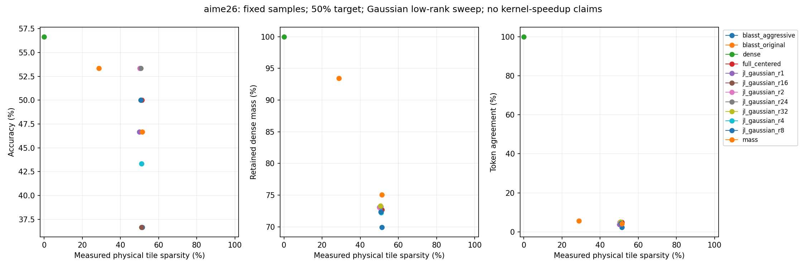
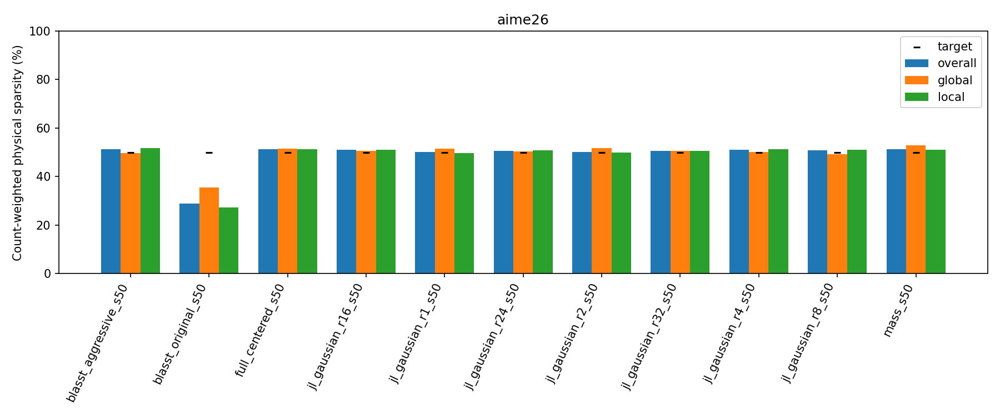
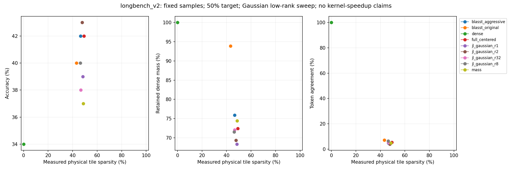
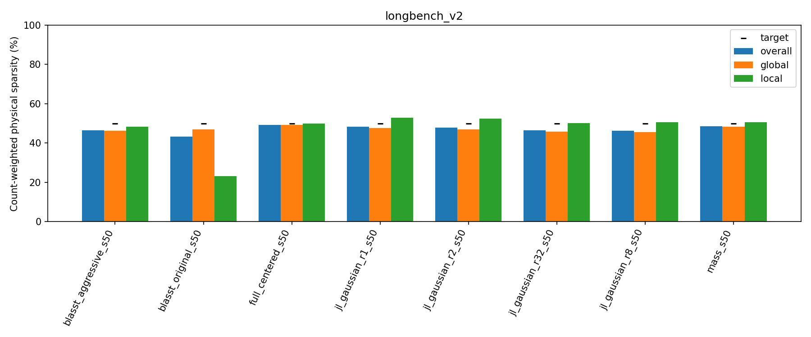

# Gaussian low-rank centered routing: AIME26 and LongBench v2-100

Status: COMPLETE; 1260/1260 audited outputs.330 new final slots plus930 reused comparison slots.

## Setup and exact sample selection

Unchanged30 AIME26 questions and all100 questions from the existing newer LongBench v2 NeMo study; no new sample selection. AIME retains2048 output tokens and its existing scorer/prompt; LongBench retains4096 output tokens,32K input cap and the pinned actual NeMo prompt/MCQ evaluator. 85/100 LongBench inputs are context-truncated; these are not full-context leaderboard results.

| domain | count |
| --- | --- |
| Code Repository Understanding | 10 |
| Long In-context Learning | 16 |
| Long Structured Data Understanding | 6 |
| Long-dialogue History Understanding | 8 |
| Multi-Document QA | 25 |
| Single-Document QA | 35 |

BF16 DiffusionGemma revision f7f5b7f5fa82ffc52addd066915886d497f5517b,seed42,canvas256,up to48 denoising steps,thinkingFalse,unchanged native0.4–0.8 sampling schedule (temperature0 sentinel is not greedy).128-query×64-KV physical tiles, prefix+canvas eligible, native structural masks/GQA. New runs: Gaussian centered rank1 on AIME and ranks1/2/8 on LongBench. All earlier compatible comparisons, including both50-question Gaussian32/full-reference cohorts, are imported without numerical changes.

## Projection and threshold rules

The existing online attention-weighted projected centered update, valid-KV RMS reference, strict worst-query physical gate, tie/first-support retention and unchanged state on skip are reused. Gaussian matrices use seed1729 and unchanged layer/native-head/rank-dependent construction/hashes. Token-value sketches and routing arithmetic are FP32; retained attention uses original V with ordinary renormalization. Rank1 only extends a process-local dimension allow-list. Existing generic GPU kernels are unchanged and validated against the trusted reference. No projection direction is selected using final scores.

Each new benchmark/rank starts with that benchmark's existing Gaussian32 scalars as an unverified trial. Rank-specific empirical CDFs come from540 historical calibration QKV snapshots; no dense generation is replayed. The unchanged local/global proposal/scalar fallback verifies up to12 points on the same six full-budget questions per benchmark, accepting only overall/global/local48–52% calibration sparsity. Policies freeze before final inference and are never retuned using final results. Baseline/full/Gaussian32 calibration conventions remain those of their sources; this asymmetry is retained and documented, not silently normalized away.

aime26 calibration IDs: aime26/2, aime26/8, aime26/14, aime26/20, aime26/23, aime26/30.

longbench_v2 calibration IDs: longbench_v2/66f168d8821e116aacb27519, longbench_v2/66f55ddb821e116aacb33761, longbench_v2/66f6b623bb02136c067c2646, longbench_v2/66fb75adbb02136c067c7d73, longbench_v2/67039cfabb02136c067cd04e, longbench_v2/6719ef50bb02136c067d4911.

Both headline sets include these six calibration members. Separate noncalibration24/94 results follow. LongBench verification IDs are the existing score-blind one-per-domain selection from the earlier50, not a new selection from100. Historical LongBench proposal/diagnostic states come from an older calibration set, as in the prior studies. All final examples were previously examined; no fresh held-out confirmation claim.

## Per-domain results before aggregation

| domain | condition | correct | count | accuracy |
| --- | --- | --- | --- | --- |
| Code Repository Understanding | blasst_aggressive_s50 | 5.0000 | 10 | 50.0000 |
| Code Repository Understanding | blasst_original_s50 | 4.0000 | 10 | 40.0000 |
| Code Repository Understanding | dense | 5.0000 | 10 | 50.0000 |
| Code Repository Understanding | full_centered_s50 | 3.0000 | 10 | 30.0000 |
| Code Repository Understanding | jl_gaussian_r1_s50 | 5.0000 | 10 | 50.0000 |
| Code Repository Understanding | jl_gaussian_r2_s50 | 4.0000 | 10 | 40.0000 |
| Code Repository Understanding | jl_gaussian_r32_s50 | 4.0000 | 10 | 40.0000 |
| Code Repository Understanding | jl_gaussian_r8_s50 | 4.0000 | 10 | 40.0000 |
| Code Repository Understanding | mass_s50 | 3.0000 | 10 | 30.0000 |
| Long In-context Learning | blasst_aggressive_s50 | 8.0000 | 16 | 50.0000 |
| Long In-context Learning | blasst_original_s50 | 7.0000 | 16 | 43.7500 |
| Long In-context Learning | dense | 6.0000 | 16 | 37.5000 |
| Long In-context Learning | full_centered_s50 | 9.0000 | 16 | 56.2500 |
| Long In-context Learning | jl_gaussian_r1_s50 | 6.0000 | 16 | 37.5000 |
| Long In-context Learning | jl_gaussian_r2_s50 | 8.0000 | 16 | 50.0000 |
| Long In-context Learning | jl_gaussian_r32_s50 | 5.0000 | 16 | 31.2500 |
| Long In-context Learning | jl_gaussian_r8_s50 | 7.0000 | 16 | 43.7500 |
| Long In-context Learning | mass_s50 | 6.0000 | 16 | 37.5000 |
| Long Structured Data Understanding | blasst_aggressive_s50 | 0.0000 | 6 | 0.0000 |
| Long Structured Data Understanding | blasst_original_s50 | 0.0000 | 6 | 0.0000 |
| Long Structured Data Understanding | dense | 0.0000 | 6 | 0.0000 |
| Long Structured Data Understanding | full_centered_s50 | 0.0000 | 6 | 0.0000 |
| Long Structured Data Understanding | jl_gaussian_r1_s50 | 2.0000 | 6 | 33.3333 |
| Long Structured Data Understanding | jl_gaussian_r2_s50 | 0.0000 | 6 | 0.0000 |
| Long Structured Data Understanding | jl_gaussian_r32_s50 | 0.0000 | 6 | 0.0000 |
| Long Structured Data Understanding | jl_gaussian_r8_s50 | 0.0000 | 6 | 0.0000 |
| Long Structured Data Understanding | mass_s50 | 0.0000 | 6 | 0.0000 |
| Long-dialogue History Understanding | blasst_aggressive_s50 | 1.0000 | 8 | 12.5000 |
| Long-dialogue History Understanding | blasst_original_s50 | 0.0000 | 8 | 0.0000 |
| Long-dialogue History Understanding | dense | 0.0000 | 8 | 0.0000 |
| Long-dialogue History Understanding | full_centered_s50 | 1.0000 | 8 | 12.5000 |
| Long-dialogue History Understanding | jl_gaussian_r1_s50 | 1.0000 | 8 | 12.5000 |
| Long-dialogue History Understanding | jl_gaussian_r2_s50 | 1.0000 | 8 | 12.5000 |
| Long-dialogue History Understanding | jl_gaussian_r32_s50 | 1.0000 | 8 | 12.5000 |
| Long-dialogue History Understanding | jl_gaussian_r8_s50 | 1.0000 | 8 | 12.5000 |
| Long-dialogue History Understanding | mass_s50 | 1.0000 | 8 | 12.5000 |
| Multi-Document QA | blasst_aggressive_s50 | 11.0000 | 25 | 44.0000 |
| Multi-Document QA | blasst_original_s50 | 12.0000 | 25 | 48.0000 |
| Multi-Document QA | dense | 10.0000 | 25 | 40.0000 |
| Multi-Document QA | full_centered_s50 | 13.0000 | 25 | 52.0000 |
| Multi-Document QA | jl_gaussian_r1_s50 | 11.0000 | 25 | 44.0000 |
| Multi-Document QA | jl_gaussian_r2_s50 | 11.0000 | 25 | 44.0000 |
| Multi-Document QA | jl_gaussian_r32_s50 | 9.0000 | 25 | 36.0000 |
| Multi-Document QA | jl_gaussian_r8_s50 | 12.0000 | 25 | 48.0000 |
| Multi-Document QA | mass_s50 | 10.0000 | 25 | 40.0000 |
| Single-Document QA | blasst_aggressive_s50 | 17.0000 | 35 | 48.5714 |
| Single-Document QA | blasst_original_s50 | 17.0000 | 35 | 48.5714 |
| Single-Document QA | dense | 13.0000 | 35 | 37.1429 |
| Single-Document QA | full_centered_s50 | 16.0000 | 35 | 45.7143 |
| Single-Document QA | jl_gaussian_r1_s50 | 14.0000 | 35 | 40.0000 |
| Single-Document QA | jl_gaussian_r2_s50 | 19.0000 | 35 | 54.2857 |
| Single-Document QA | jl_gaussian_r32_s50 | 19.0000 | 35 | 54.2857 |
| Single-Document QA | jl_gaussian_r8_s50 | 16.0000 | 35 | 45.7143 |
| Single-Document QA | mass_s50 | 17.0000 | 35 | 48.5714 |

## Main results

### aime26: full

| benchmark | split | condition | threshold | correct | count | accuracy | delta_pp | ci95_pp | whole | global_s | local_s | mass | agreement | local_operator_error | length_limited |
| --- | --- | --- | --- | --- | --- | --- | --- | --- | --- | --- | --- | --- | --- | --- | --- |
| aime26 | full | blasst_aggressive_s50 | local: exp(8.09133)/L; global: exp(7.77928)/L | 11.0000 | 30 | 36.6667 | -20.0000 | [-36.666666666666664, -3.3333333333333335] | 51.3614 | 49.6095 | 51.7731 | 69.9423 | 2.4106 | 0.5001 | 6 |
| aime26 | full | blasst_original_s50 | local: 1 (unattainable); global: 1 (unattainable) | 16.0000 | 30 | 53.3333 | -3.3333 | [-20.0, 13.333333333333334] | 28.8187 | 35.4672 | 27.2322 | 93.4179 | 5.7355 | 0.1468 | 2 |
| aime26 | full | dense | none / ranking budget | 17.0000 | 30 | 56.6667 | 0.0000 | [0.0, 0.0] | 0.0000 | 0.0000 | 0.0000 | 100.0000 | 100.0000 | 0.0000 | 6 |
| aime26 | full | full_centered_s50 | local: exp(-0.740297); global: exp(-1.21186) | 15.0000 | 30 | 50.0000 | -6.6667 | [-23.333333333333332, 13.333333333333334] | 51.3059 | 51.4252 | 51.2764 | 72.6830 | 4.8750 | 0.2574 | 7 |
| aime26 | full | jl_gaussian_r16_s50 | local: exp(-0.759528); global: exp(-1.23614) | 11.0000 | 30 | 36.6667 | -20.0000 | [-36.666666666666664, -3.3333333333333335] | 51.0359 | 50.6811 | 51.1250 | 72.5367 | 4.7336 | 0.2621 | 8 |
| aime26 | full | jl_gaussian_r1_s50 | local: exp(-0.861193); global: exp(-1.23614) | 14.0000 | 30 | 46.6667 | -10.0000 | [-26.666666666666668, 6.666666666666667] | 50.0424 | 51.5278 | 49.6772 | 73.0786 | 3.9084 | 0.3187 | 6 |
| aime26 | full | jl_gaussian_r24_s50 | local: exp(-0.759528); global: exp(-1.23614) | 16.0000 | 30 | 53.3333 | -3.3333 | [-20.0, 13.333333333333334] | 50.6719 | 50.3491 | 50.7493 | 73.1916 | 4.7789 | 0.2526 | 5 |
| aime26 | full | jl_gaussian_r2_s50 | local: exp(-0.855113); global: exp(-1.26686) | 16.0000 | 30 | 53.3333 | -3.3333 | [-20.0, 13.333333333333334] | 50.2052 | 51.6311 | 49.8471 | 73.0259 | 4.8962 | 0.2808 | 8 |
| aime26 | full | jl_gaussian_r32_s50 | local: exp(-0.759528); global: exp(-1.23614) | 15.0000 | 30 | 50.0000 | -6.6667 | [-26.666666666666668, 10.0] | 50.6621 | 50.6697 | 50.6602 | 73.3096 | 5.1972 | 0.2527 | 5 |
| aime26 | full | jl_gaussian_r4_s50 | local: exp(-0.759528); global: exp(-1.23614) | 13.0000 | 30 | 43.3333 | -13.3333 | [-30.0, 0.0] | 51.0165 | 50.2353 | 51.2063 | 72.2207 | 4.4689 | 0.2722 | 6 |
| aime26 | full | jl_gaussian_r8_s50 | local: exp(-0.759528); global: exp(-1.26821) | 15.0000 | 30 | 50.0000 | -6.6667 | [-20.0, 6.666666666666667] | 50.7810 | 49.3227 | 51.1449 | 72.3521 | 4.3280 | 0.2664 | 6 |
| aime26 | full | mass_s50 | local: exp(-0.0184422); global: exp(-0.04564) | 14.0000 | 30 | 46.6667 | -10.0000 | [-23.333333333333332, 3.3333333333333335] | 51.3914 | 52.9351 | 51.0090 | 75.0530 | 4.2693 | 0.3014 | 8 |

### aime26: noncalibration24

| benchmark | split | condition | threshold | correct | count | accuracy | delta_pp | ci95_pp | whole | global_s | local_s | mass | agreement | local_operator_error | length_limited |
| --- | --- | --- | --- | --- | --- | --- | --- | --- | --- | --- | --- | --- | --- | --- | --- |
| aime26 | noncalibration24 | blasst_aggressive_s50 | local: exp(8.09133)/L; global: exp(7.77928)/L | 9.0000 | 24 | 37.5000 | -20.8333 | [-41.66666666666667, 0.0] | 51.3468 | 49.6216 | 51.7528 | 70.3458 | 2.5868 | 0.4932 | 5 |
| aime26 | noncalibration24 | blasst_original_s50 | local: 1 (unattainable); global: 1 (unattainable) | 13.0000 | 24 | 54.1667 | -4.1667 | [-25.0, 16.666666666666664] | 28.9761 | 35.2079 | 27.4916 | 93.4145 | 6.0140 | 0.1471 | 2 |
| aime26 | noncalibration24 | dense | none / ranking budget | 14.0000 | 24 | 58.3333 | 0.0000 | [0.0, 0.0] | 0.0000 | 0.0000 | 0.0000 | 100.0000 | 100.0000 | 0.0000 | 5 |
| aime26 | noncalibration24 | full_centered_s50 | local: exp(-0.740297); global: exp(-1.21186) | 12.0000 | 24 | 50.0000 | -8.3333 | [-29.166666666666668, 16.666666666666664] | 51.4690 | 51.8490 | 51.3750 | 72.5994 | 5.0550 | 0.2566 | 5 |
| aime26 | noncalibration24 | jl_gaussian_r16_s50 | local: exp(-0.759528); global: exp(-1.23614) | 9.0000 | 24 | 37.5000 | -20.8333 | [-41.66666666666667, 0.0] | 51.0446 | 50.5084 | 51.1785 | 72.4809 | 4.6988 | 0.2616 | 5 |
| aime26 | noncalibration24 | jl_gaussian_r1_s50 | local: exp(-0.861193); global: exp(-1.23614) | 12.0000 | 24 | 50.0000 | -8.3333 | [-29.166666666666668, 12.5] | 50.1645 | 52.1946 | 49.6609 | 73.0432 | 3.7793 | 0.3181 | 5 |
| aime26 | noncalibration24 | jl_gaussian_r24_s50 | local: exp(-0.759528); global: exp(-1.23614) | 14.0000 | 24 | 58.3333 | 0.0000 | [-16.666666666666664, 16.666666666666664] | 50.7907 | 50.6287 | 50.8295 | 73.2865 | 4.8486 | 0.2499 | 4 |
| aime26 | noncalibration24 | jl_gaussian_r2_s50 | local: exp(-0.855113); global: exp(-1.26686) | 13.0000 | 24 | 54.1667 | -4.1667 | [-25.0, 16.666666666666664] | 50.2899 | 51.7818 | 49.9166 | 72.9160 | 4.7718 | 0.2805 | 5 |
| aime26 | noncalibration24 | jl_gaussian_r32_s50 | local: exp(-0.759528); global: exp(-1.23614) | 12.0000 | 24 | 50.0000 | -8.3333 | [-29.166666666666668, 12.5] | 50.7085 | 51.0653 | 50.6203 | 73.4097 | 4.7615 | 0.2503 | 4 |
| aime26 | noncalibration24 | jl_gaussian_r4_s50 | local: exp(-0.759528); global: exp(-1.23614) | 11.0000 | 24 | 45.8333 | -12.5000 | [-29.166666666666668, 4.166666666666666] | 51.1704 | 50.4091 | 51.3548 | 72.1046 | 4.6195 | 0.2714 | 4 |
| aime26 | noncalibration24 | jl_gaussian_r8_s50 | local: exp(-0.759528); global: exp(-1.26821) | 13.0000 | 24 | 54.1667 | -4.1667 | [-16.666666666666664, 8.333333333333332] | 50.8264 | 49.4029 | 51.1839 | 72.2483 | 4.4189 | 0.2666 | 5 |
| aime26 | noncalibration24 | mass_s50 | local: exp(-0.0184422); global: exp(-0.04564) | 11.0000 | 24 | 45.8333 | -12.5000 | [-29.166666666666668, 4.166666666666666] | 51.6113 | 53.1945 | 51.2174 | 74.9433 | 3.8060 | 0.3024 | 6 |

### aime26: calibration6

| benchmark | split | condition | threshold | correct | count | accuracy | delta_pp | ci95_pp | whole | global_s | local_s | mass | agreement | local_operator_error | length_limited |
| --- | --- | --- | --- | --- | --- | --- | --- | --- | --- | --- | --- | --- | --- | --- | --- |
| aime26 | calibration6 | blasst_aggressive_s50 | local: exp(8.09133)/L; global: exp(7.77928)/L | 2.0000 | 6 | 33.3333 | -16.6667 | [-50.0, 0.0] | 51.4369 | 49.5463 | 51.8781 | 68.0513 | 1.7749 | 0.5307 | 1 |
| aime26 | calibration6 | blasst_original_s50 | local: 1 (unattainable); global: 1 (unattainable) | 3.0000 | 6 | 50.0000 | 0.0000 | [0.0, 0.0] | 28.2558 | 36.3890 | 26.3026 | 93.4299 | 4.7543 | 0.1460 | 0 |
| aime26 | calibration6 | dense | none / ranking budget | 3.0000 | 6 | 50.0000 | 0.0000 | [0.0, 0.0] | 0.0000 | 0.0000 | 0.0000 | 100.0000 | 100.0000 | 0.0000 | 1 |
| aime26 | calibration6 | full_centered_s50 | local: exp(-0.740297); global: exp(-1.21186) | 3.0000 | 6 | 50.0000 | 0.0000 | [0.0, 0.0] | 50.7106 | 49.8685 | 50.9173 | 72.9874 | 4.2374 | 0.2600 | 2 |
| aime26 | calibration6 | jl_gaussian_r16_s50 | local: exp(-0.759528); global: exp(-1.23614) | 2.0000 | 6 | 33.3333 | -16.6667 | [-50.0, 0.0] | 51.0102 | 51.1809 | 50.9667 | 72.7032 | 4.8503 | 0.2636 | 3 |
| aime26 | calibration6 | jl_gaussian_r1_s50 | local: exp(-0.861193); global: exp(-1.23614) | 2.0000 | 6 | 33.3333 | -16.6667 | [-50.0, 0.0] | 49.5696 | 48.8526 | 49.7398 | 73.2104 | 4.3975 | 0.3209 | 1 |
| aime26 | calibration6 | jl_gaussian_r24_s50 | local: exp(-0.759528); global: exp(-1.23614) | 2.0000 | 6 | 33.3333 | -16.6667 | [-66.66666666666666, 33.33333333333333] | 50.2803 | 49.4284 | 50.4848 | 72.8789 | 4.5455 | 0.2612 | 1 |
| aime26 | calibration6 | jl_gaussian_r2_s50 | local: exp(-0.855113); global: exp(-1.26686) | 3.0000 | 6 | 50.0000 | 0.0000 | [0.0, 0.0] | 49.9440 | 51.1716 | 49.6323 | 73.3695 | 5.3336 | 0.2819 | 3 |
| aime26 | calibration6 | jl_gaussian_r32_s50 | local: exp(-0.759528); global: exp(-1.23614) | 3.0000 | 6 | 50.0000 | 0.0000 | [0.0, 0.0] | 50.4950 | 49.2175 | 50.8033 | 72.9448 | 6.7698 | 0.2612 | 1 |
| aime26 | calibration6 | jl_gaussian_r4_s50 | local: exp(-0.759528); global: exp(-1.23614) | 2.0000 | 6 | 33.3333 | -16.6667 | [-50.0, 0.0] | 50.5042 | 49.6628 | 50.7107 | 72.6063 | 3.9512 | 0.2747 | 2 |
| aime26 | calibration6 | jl_gaussian_r8_s50 | local: exp(-0.759528); global: exp(-1.26821) | 2.0000 | 6 | 33.3333 | -16.6667 | [-50.0, 0.0] | 50.6012 | 48.9974 | 50.9915 | 72.7494 | 3.9933 | 0.2655 | 1 |
| aime26 | calibration6 | mass_s50 | local: exp(-0.0184422); global: exp(-0.04564) | 3.0000 | 6 | 50.0000 | 0.0000 | [0.0, 0.0] | 50.5555 | 51.9324 | 50.2199 | 75.4630 | 5.9010 | 0.2977 | 2 |

### longbench_v2: full

| benchmark | split | condition | threshold | correct | count | accuracy | delta_pp | ci95_pp | whole | global_s | local_s | mass | agreement | local_operator_error | length_limited |
| --- | --- | --- | --- | --- | --- | --- | --- | --- | --- | --- | --- | --- | --- | --- | --- |
| longbench_v2 | full | blasst_aggressive_s50 | local: exp(8.37258)/L; global: exp(8.36106)/L | 42.0000 | 100 | 42.0000 | 8.0000 | [1.0, 15.0] | 46.5331 | 46.1926 | 48.3034 | 75.8775 | 4.7667 | 0.3400 | 0 |
| longbench_v2 | full | blasst_original_s50 | local: exp(0); global: min(1, exp(8.36106)/L) | 40.0000 | 100 | 40.0000 | 6.0000 | [1.0, 12.0] | 43.1900 | 47.0134 | 23.1977 | 93.8947 | 7.1610 | 0.1298 | 0 |
| longbench_v2 | full | dense | none / ranking budget | 34.0000 | 100 | 34.0000 | 0.0000 | [0.0, 0.0] | 0.0000 | 0.0000 | 0.0000 | 100.0000 | 100.0000 | 0.0000 | 0 |
| longbench_v2 | full | full_centered_s50 | local: exp(-0.731019); global: exp(-5.01796) | 42.0000 | 100 | 42.0000 | 8.0000 | [0.0, 16.0] | 49.3069 | 49.1905 | 49.9050 | 72.4297 | 5.2680 | 0.2772 | 0 |
| longbench_v2 | full | jl_gaussian_r1_s50 | local: exp(-0.72214); global: exp(-5.24292) | 39.0000 | 100 | 39.0000 | 5.0000 | [-3.0, 13.0] | 48.4172 | 47.5588 | 52.9150 | 68.3656 | 4.7216 | 0.3686 | 1 |
| longbench_v2 | full | jl_gaussian_r2_s50 | local: exp(-0.72214); global: exp(-5.25267) | 43.0000 | 100 | 43.0000 | 9.0000 | [2.0, 16.0] | 47.7770 | 46.8954 | 52.3755 | 69.3686 | 3.9663 | 0.3235 | 1 |
| longbench_v2 | full | jl_gaussian_r32_s50 | local: exp(-0.72214); global: exp(-5.16173) | 38.0000 | 100 | 38.0000 | 4.0000 | [-5.0, 13.0] | 46.5675 | 45.8683 | 50.1909 | 72.0562 | 5.2608 | 0.2825 | 0 |
| longbench_v2 | full | jl_gaussian_r8_s50 | local: exp(-0.72214); global: exp(-5.16173) | 40.0000 | 100 | 40.0000 | 6.0000 | [-2.0, 14.000000000000002] | 46.3212 | 45.5109 | 50.5592 | 71.5069 | 6.3420 | 0.2934 | 0 |
| longbench_v2 | full | mass_s50 | local: exp(-0.0152636); global: exp(-1.3682) | 37.0000 | 100 | 37.0000 | 3.0000 | [-5.0, 11.0] | 48.6206 | 48.2219 | 50.6940 | 74.4399 | 4.7523 | 0.3158 | 0 |

### longbench_v2: noncalibration94

| benchmark | split | condition | threshold | correct | count | accuracy | delta_pp | ci95_pp | whole | global_s | local_s | mass | agreement | local_operator_error | length_limited |
| --- | --- | --- | --- | --- | --- | --- | --- | --- | --- | --- | --- | --- | --- | --- | --- |
| longbench_v2 | noncalibration94 | blasst_aggressive_s50 | local: exp(8.37258)/L; global: exp(8.36106)/L | 40.0000 | 94 | 42.5532 | 7.4468 | [0.0, 14.893617021276595] | 46.3974 | 46.0303 | 48.3006 | 75.8891 | 4.6420 | 0.3396 | 0 |
| longbench_v2 | noncalibration94 | blasst_original_s50 | local: exp(0); global: min(1, exp(8.36106)/L) | 39.0000 | 94 | 41.4894 | 6.3830 | [1.0638297872340425, 12.76595744680851] | 42.9533 | 46.7367 | 23.2169 | 93.8998 | 7.2414 | 0.1296 | 0 |
| longbench_v2 | noncalibration94 | dense | none / ranking budget | 33.0000 | 94 | 35.1064 | 0.0000 | [0.0, 0.0] | 0.0000 | 0.0000 | 0.0000 | 100.0000 | 100.0000 | 0.0000 | 0 |
| longbench_v2 | noncalibration94 | full_centered_s50 | local: exp(-0.731019); global: exp(-5.01796) | 41.0000 | 94 | 43.6170 | 8.5106 | [0.0, 17.02127659574468] | 49.0992 | 48.9374 | 49.9285 | 72.4090 | 5.3148 | 0.2769 | 0 |
| longbench_v2 | noncalibration94 | jl_gaussian_r1_s50 | local: exp(-0.72214); global: exp(-5.24292) | 38.0000 | 94 | 40.4255 | 5.3191 | [-3.1914893617021276, 13.829787234042554] | 48.2843 | 47.3873 | 52.9756 | 68.3273 | 4.7439 | 0.3682 | 1 |
| longbench_v2 | noncalibration94 | jl_gaussian_r2_s50 | local: exp(-0.72214); global: exp(-5.25267) | 41.0000 | 94 | 43.6170 | 8.5106 | [2.127659574468085, 15.957446808510639] | 47.6576 | 46.7433 | 52.4183 | 69.3472 | 3.9265 | 0.3233 | 1 |
| longbench_v2 | noncalibration94 | jl_gaussian_r32_s50 | local: exp(-0.72214); global: exp(-5.16173) | 36.0000 | 94 | 38.2979 | 3.1915 | [-6.382978723404255, 11.702127659574469] | 46.2814 | 45.5173 | 50.2282 | 72.0935 | 5.2672 | 0.2820 | 0 |
| longbench_v2 | noncalibration94 | jl_gaussian_r8_s50 | local: exp(-0.72214); global: exp(-5.16173) | 38.0000 | 94 | 40.4255 | 5.3191 | [-2.127659574468085, 13.829787234042554] | 46.1465 | 45.2933 | 50.5987 | 71.4865 | 6.4158 | 0.2933 | 0 |
| longbench_v2 | noncalibration94 | mass_s50 | local: exp(-0.0152636); global: exp(-1.3682) | 35.0000 | 94 | 37.2340 | 2.1277 | [-5.319148936170213, 9.574468085106384] | 48.5276 | 48.0999 | 50.7472 | 74.4251 | 4.7797 | 0.3162 | 0 |

### longbench_v2: calibration6

| benchmark | split | condition | threshold | correct | count | accuracy | delta_pp | ci95_pp | whole | global_s | local_s | mass | agreement | local_operator_error | length_limited |
| --- | --- | --- | --- | --- | --- | --- | --- | --- | --- | --- | --- | --- | --- | --- | --- |
| longbench_v2 | calibration6 | blasst_aggressive_s50 | local: exp(8.37258)/L; global: exp(8.36106)/L | 2.0000 | 6 | 33.3333 | 16.6667 | [0.0, 50.0] | 48.9462 | 49.0543 | 48.3567 | 75.6620 | 6.8785 | 0.3457 | 0 |
| longbench_v2 | calibration6 | blasst_original_s50 | local: exp(0); global: min(1, exp(8.36106)/L) | 1.0000 | 6 | 16.6667 | 0.0000 | [0.0, 0.0] | 47.2844 | 51.7655 | 22.8533 | 93.8025 | 5.7954 | 0.1328 | 0 |
| longbench_v2 | calibration6 | dense | none / ranking budget | 1.0000 | 6 | 16.6667 | 0.0000 | [0.0, 0.0] | 0.0000 | 0.0000 | 0.0000 | 100.0000 | 100.0000 | 0.0000 | 0 |
| longbench_v2 | calibration6 | full_centered_s50 | local: exp(-0.731019); global: exp(-5.01796) | 1.0000 | 6 | 16.6667 | 0.0000 | [0.0, 0.0] | 53.0525 | 53.7114 | 49.4588 | 72.8238 | 4.4389 | 0.2825 | 0 |
| longbench_v2 | calibration6 | jl_gaussian_r1_s50 | local: exp(-0.72214); global: exp(-5.24292) | 1.0000 | 6 | 16.6667 | 0.0000 | [0.0, 0.0] | 50.9554 | 50.8157 | 51.7171 | 69.1243 | 4.2849 | 0.3765 | 0 |
| longbench_v2 | calibration6 | jl_gaussian_r2_s50 | local: exp(-0.72214); global: exp(-5.25267) | 2.0000 | 6 | 33.3333 | 16.6667 | [0.0, 50.0] | 50.7765 | 50.6881 | 51.2576 | 69.9277 | 4.7769 | 0.3309 | 0 |
| longbench_v2 | calibration6 | jl_gaussian_r32_s50 | local: exp(-0.72214); global: exp(-5.16173) | 2.0000 | 6 | 33.3333 | 16.6667 | [0.0, 50.0] | 50.8484 | 51.0763 | 49.6063 | 71.4712 | 5.1410 | 0.2907 | 0 |
| longbench_v2 | calibration6 | jl_gaussian_r8_s50 | local: exp(-0.72214); global: exp(-5.16173) | 2.0000 | 6 | 33.3333 | 16.6667 | [0.0, 50.0] | 49.6020 | 49.5677 | 49.7890 | 71.9044 | 5.0235 | 0.2954 | 0 |
| longbench_v2 | calibration6 | mass_s50 | local: exp(-0.0152636); global: exp(-1.3682) | 2.0000 | 6 | 33.3333 | 16.6667 | [0.0, 50.0] | 50.7132 | 50.9457 | 49.4460 | 74.7866 | 4.2299 | 0.3065 | 0 |

## New ranks versus Gaussian32/full-dimensional

| benchmark | candidate | reference | candidate_correct | reference_correct | delta_pp | paired_ci95_pp | overall_sparsity_gap_pp | global_sparsity_gap_pp | local_sparsity_gap_pp | within2pp_all_types |
| --- | --- | --- | --- | --- | --- | --- | --- | --- | --- | --- |
| aime26 | jl_gaussian_r1_s50 | full_centered_s50 | 14.0000 | 15.0000 | -3.3333 | [-20.0, 13.333333333333334] | -1.2635 | 0.1027 | -1.5992 | True |
| aime26 | jl_gaussian_r1_s50 | jl_gaussian_r32_s50 | 14.0000 | 15.0000 | -3.3333 | [-26.666666666666668, 16.666666666666664] | -0.6197 | 0.8581 | -0.9830 | True |
| longbench_v2 | jl_gaussian_r1_s50 | full_centered_s50 | 39.0000 | 42.0000 | -3.0000 | [-11.0, 5.0] | -0.8897 | -1.6316 | 3.0100 | False |
| longbench_v2 | jl_gaussian_r1_s50 | jl_gaussian_r32_s50 | 39.0000 | 38.0000 | 1.0000 | [-7.000000000000001, 9.0] | 1.8497 | 1.6905 | 2.7241 | False |
| longbench_v2 | jl_gaussian_r2_s50 | full_centered_s50 | 43.0000 | 42.0000 | 1.0000 | [-7.000000000000001, 9.0] | -1.5298 | -2.2951 | 2.4704 | False |
| longbench_v2 | jl_gaussian_r2_s50 | jl_gaussian_r32_s50 | 43.0000 | 38.0000 | 5.0000 | [-4.0, 14.000000000000002] | 1.2095 | 1.0270 | 2.1846 | False |
| longbench_v2 | jl_gaussian_r8_s50 | full_centered_s50 | 40.0000 | 42.0000 | -2.0000 | [-9.0, 5.0] | -2.9856 | -3.6796 | 0.6541 | False |
| longbench_v2 | jl_gaussian_r8_s50 | jl_gaussian_r32_s50 | 40.0000 | 38.0000 | 2.0000 | [-4.0, 8.0] | -0.2463 | -0.3575 | 0.3683 | True |

All direct comparisons (including dense, BLASST and mass) are exported. Actual sparsity and local/global allocations, not target labels, define comparability. Original BLASST's capped lambda1 may be unattainable at50%; its lower attained point is not relabeled. Aggressive BLASST allows lambda>1 under its existing rule. Mass is the existing max-based mass bound, not exact mass-only routing.

## Measurements, diagnostics and limitations

Physical sparsity is SUM(skipped eligible tiles)/SUM(eligible tiles), excluding unchanged dense prefill. Retained dense mass and full-dimensional local output error use corresponding QKV in each execution; they are not aligned dense-generation states after divergence. Shared-QKV diagnostics separately use32 early AIME and34 early LongBench states per method, one head/query tile per sampled state, with error=sqrt(SUM(error squared)/SUM(dense output squared)). Risk underestimation, overlapping type statistics and layer/head/step/type/region breakdowns are exported. These early states do not exhaust final generation.

Token agreement compares all generated positions after divergence; missing/extra positions disagree and EOS is included. Benchmark accuracy is micro, with domain breakdowns and equal-task macro exported. Paired prompt-bootstrap95% intervals use the existing20000-draw procedure, condition on fixed policies/seeds and are exploratory, not multiplicity-corrected. Rank changes also change random directions; one seed does not establish dimension/seed robustness.

QK, block softmax and projected PV remain computed. Original full-dimensional PV is diagnostic-only for projected routing; retained native PV remains a masked dense-shaped matmul. Sketch projection/storage/refresh/reuse is recorded. No hardware-speedup/FlashAttention claim. Cached native and rank2/8 smoke outputs are raw-audited; rank1 receives fresh model-level unpruned-native and pruned-trusted checks.

Missing=0; violations=0. Failures remain preserved and independent configurations continue. Reproduce from raw shards without inference: `python -m experiments.diffusion_gemma_jl_lowrank_multibench_v2 report`, followed by `verify`.
