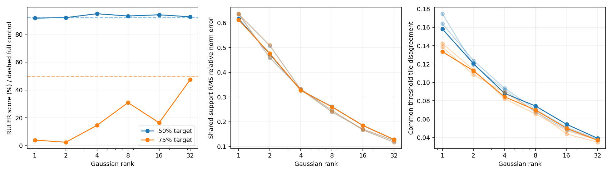

# Does projection information loss explain the RULER8K accuracy drop?

**The results strongly support it as a major contributor at75% sparsity. Gaussian32 recovers most of the Gaussian2–full gap. It is not the only limitation, and downstream accuracy is not monotonic in rank.**

Complete, independently audited experiment:130 matched questions (10 each of13 tasks),19 conditions,2470 final outputs. Added Gaussian1/4/8/16/32 at50% and75%; reused dense, BLASST, mass-only, full-dimensional and Gaussian2 unchanged. All41 CPU/CUDA tests and the two-input real-model smoke passed; no calibration/generation failures or audit violations.

## Main results

Official RULER equal-task score, including fractional multi-answer credit. Dense score:89.23%. Each cell is accuracy at the measured count-weighted physical sparsity.

|Method|50% target: actual sparsity %|Score %|75% target: actual sparsity %|Score %|
|---|---:|---:|---:|---:|
|BLASST|52.27|92.23|75.19|3.27|
|Mass-only|49.55|93.08|75.23|21.27|
|Full-dimensional|50.93|91.92|75.89|49.78|
|Gaussian1|50.08|91.54|74.90|4.04|
|Gaussian2 (reused)|50.77|91.92|75.64|2.50|
|Gaussian4|50.98|94.73|76.22|14.62|
|Gaussian8|50.29|93.08|76.64|30.91|
|Gaussian16|50.96|93.97|76.19|16.46|
|Gaussian32|50.17|92.50|76.04|47.38|

## Interpretation

At75%, Gaussian32 gains44.88 percentage points over Gaussian2 (paired95% CI [38.41, 51.31]), recovering94.9% of the observed Gaussian2-to-full score gap. Its actual sparsity is76.04%, versus75.64% for Gaussian2 and75.89% for full. Gaussian32/full global sparsities are76.54/76.26%; local sparsities75.38/75.40%, so the recovery is not explained by retaining substantially more tiles.

Gaussian32 minus full is-2.40pp (95% CI [-10.00, 5.09]). The observed scores are close and the difference is inconclusive; this is not a formal equivalence result. Gaussian32 exceeds mass-only by26.12pp (95% CI [18.01, 34.31]) at0.81pp more physical sparsity.

The identical-support diagnostics provide direct evidence of information loss: at75%, Gaussian2’s RMS relative update-norm distortion is0.477, versus0.128 for Gaussian32. More-than-twofold underestimation affects27.20% versus0.00033% of nonzero supported row/block updates. Common-threshold physical-tile decision disagreement falls from11.27% to3.68%. The normalizer, retained history, QKV state and full-dimensional threshold are identical in this comparison; counterfactual sketch decisions do not alter history.

Distortion improves across all three prespecified diagnostic seeds: Gaussian2 RMS error0.461–0.511 versus Gaussian32 0.117–0.128. The reduction appears in both global and local layers: primary-seed Gaussian2→32 RMS errors are0.493→0.129 global and0.453→0.128 local. These seed checks test diagnostic robustness, not end-to-end accuracy robustness.

Generation and operator evidence are consistent for Gaussian32: shared-QKV relative output error0.585 versus0.588 for full, and token agreement with dense28.27% versus27.36%. Retained mass is nearly identical at40.00% versus39.92%. Gaussian2 retains38.67% mass yet has only7.24% token agreement and2.50% score. Total retained mass alone does not explain the accuracy gap.

An important exception is Gaussian16: it scores16.46%, below Gaussian8’s30.91%, despite lower common-support norm distortion. The8-minus16 paired difference is14.45pp (95% CI7.08–21.68pp). Thus scalar distortion is not a sufficient predictor of final accuracy. Rank-dependent projection directions, calibrated decision boundaries, which individual updates are lost, and adaptive generation histories remain possible contributors; this experiment does not isolate their individual effects. The deployed-support shared-state operator error is also slightly worse for16 than8 (0.645 versus0.634).

At50%, all Gaussian ranks score91.54–94.73% and full scores91.92%; there is no systematic accuracy penalty as rank decreases. Do not select Gaussian4 as an established winner from this sample. Its apparent advantage includes the VT answer-budget effect described below.

Projection is not the whole problem at75%: even full-dimensional centered routing falls from the dense89.23% score to49.78%. Removing projection loss does not make this aggressive pruning regime accuracy-preserving.

## Caveats and reproducibility

All10 dense VT outputs exhaust the unchanged30-token official budget and score0. Some sparse runs answer more tersely. Excluding VT post-hoc gives dense96.67%; at75%, Gaussian2 2.71%, Gaussian32 49.67%, full50.93%, preserving the main conclusion. At50%, Gaussian4’s primary94.73% vs full91.92% reverses on the non-VT sensitivity:95.96% vs96.25%. This is a disclosed sensitivity analysis, not the primary benchmark or grounds to alter budgets after seeing scores.

Thresholds were independently verified within2pp on26 disjoint calibration questions, then frozen. Final examples/settings match v14; no kernel, operator or decoding changes were made. Shared diagnostics cover390 states across13 tasks/30 layers at step0, not later adaptive sparse trajectories. The full retained-support probe is diagnostic-only and uses the full threshold, not the separately calibrated deployed rank threshold.

All ranks use the existing Gaussian generator with projection seed1729 for generation; matrices are fixed per layer/native KV head, but not nested across ranks. One generation seed and previously examined examples limit causal/generalization claims. Reported paired intervals are unadjusted across multiple comparisons. No hardware speedup is measured or claimed.

Full methods, local/global statistics, thresholds, per-task scores and diagnostics: [canonical report](report.md). Raw results/CSV/JSON and independent regeneration proof are in this directory. This interpretation is a separately provenance-checked post-audit artifact; it does not overwrite the frozen canonical report.
