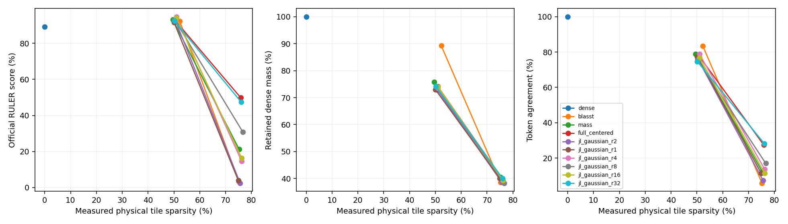
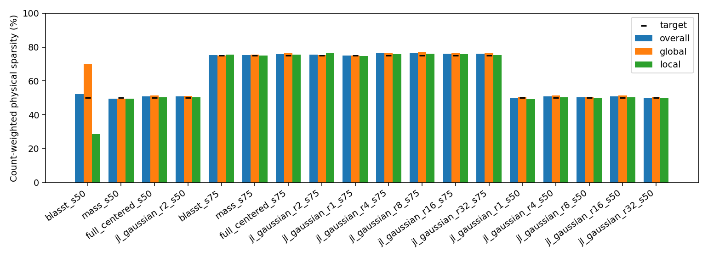

# RULER8K Gaussian projection-rank sweep

Audited generations: 2470/2470; complete: True. This extends the completed v14 experiment without modifying its results or kernels.

## Controlled setup

130 matched final questions,10 each across all13 RULER tasks. Same disjoint26 calibration (2/task) and13 development (1/task) questions. All1170 v14 final outputs are reused;1300 new final outputs cover Gaussian1/4/8/16/32 at50% and75%. The cached pool and final examples have been examined previously; this is not fresh held-out confirmation.

Pinned DiffusionGemma revision `f7f5b7f5fa82ffc52addd066915886d497f5517b`; BF16;128-query×64-KV physical tiles; prefix+canvas skippable; native structural masks/GQA; local window1024. Original V is used for retained attention, renormalized without correction. FP32 projection/routing, TF32 disabled; fixed Gaussian matrices per layer/native KV head with seed1729, N(0,1/r) entries. Matrices follow the existing rank-dependent seed derivation and are not nested across ranks.

Same prompts, generation seed42, official task budgets,256-token canvas,48-step limit, thinking=False. Requested temperature0 remains the native0.8→0.4 schedule sentinel, not greedy decoding. 8K is the official generator total budget before chat-template overhead. Official RULER scoring is used, including fractional multi-answer credit.

| Task | Final / calibration | Output-token budget |
|---|---:|---:|
|niah_single_1|10 / 2|128|
|niah_single_2|10 / 2|128|
|niah_single_3|10 / 2|128|
|niah_multikey_1|10 / 2|128|
|niah_multikey_2|10 / 2|128|
|niah_multikey_3|10 / 2|128|
|niah_multivalue|10 / 2|128|
|niah_multiquery|10 / 2|128|
|vt|10 / 2|30|
|cwe|10 / 2|120|
|fwe|10 / 2|50|
|qa_1|10 / 2|32|
|qa_2|10 / 2|32|

## Accuracy at measured sparsity

Sparsity is sum(skipped eligible physical tiles)/sum(eligible physical tiles), not a mean of sample percentages. Mass is dense attention probability on retained positions on each candidate’s own QKV states, averaged over valid query rows. Token agreement counts equal token IDs at every position, including after divergence; missing/extra positions disagree. Operator error is reported separately on identical cached dense QKV states.

|Condition|Score %|Δ dense pp|95% paired CI pp|Actual %|Global %|Local %|Mass %|Token agreement %|
|---|---:|---:|---|---:|---:|---:|---:|---:|
|dense|89.23|0.00|[0.00, 0.00]|0.00|0.00|0.00|100.00|100.00|
|blasst_s50|92.23|3.00|[0.69, 5.38]|52.27|69.81|28.67|89.25|83.49|
|mass_s50|93.08|3.85|[1.54, 6.92]|49.55|49.55|49.55|75.86|78.86|
|full_centered_s50|91.92|2.69|[0.38, 5.38]|50.93|51.35|50.36|74.11|77.57|
|jl_gaussian_r1_s50|91.54|2.31|[0.00, 4.62]|50.08|50.69|49.25|72.91|77.39|
|jl_gaussian_r2_s50|91.92|2.69|[-0.38, 6.15]|50.77|51.05|50.39|72.88|74.99|
|jl_gaussian_r4_s50|94.73|5.50|[3.23, 7.42]|50.98|51.42|50.38|73.55|78.85|
|jl_gaussian_r8_s50|93.08|3.85|[1.54, 6.92]|50.29|50.71|49.74|74.07|75.64|
|jl_gaussian_r16_s50|93.97|4.74|[1.67, 8.08]|50.96|51.52|50.22|74.00|76.83|
|jl_gaussian_r32_s50|92.50|3.27|[0.58, 6.15]|50.17|50.27|50.05|74.20|74.65|
|blasst_s75|3.27|-85.96|[-89.23, -82.31]|75.19|75.02|75.43|38.55|5.82|
|mass_s75|21.27|-67.96|[-73.65, -62.12]|75.23|75.49|74.90|40.53|12.40|
|full_centered_s75|49.78|-39.45|[-46.31, -32.81]|75.89|76.26|75.40|39.92|27.36|
|jl_gaussian_r1_s75|4.04|-85.19|[-88.65, -81.35]|74.90|74.99|74.77|40.09|11.38|
|jl_gaussian_r2_s75|2.50|-86.73|[-90.00, -83.65]|75.64|75.20|76.24|38.67|7.24|
|jl_gaussian_r4_s75|14.62|-74.62|[-80.08, -68.85]|76.22|76.59|75.71|39.30|13.70|
|jl_gaussian_r8_s75|30.91|-58.32|[-64.79, -51.73]|76.64|77.04|76.09|38.32|16.98|
|jl_gaussian_r16_s75|16.46|-72.77|[-77.62, -67.81]|76.19|76.52|75.74|39.33|11.50|
|jl_gaussian_r32_s75|47.38|-41.85|[-48.00, -35.74]|76.04|76.54|75.38|40.00|28.26|

Paired uncertainty:10,000 task-stratified prompt bootstrap draws, seed42. These are unadjusted descriptive intervals across many rank comparisons, not multiplicity-controlled discovery tests.

## Thresholds and calibration

Each new rank is calibrated on26 calibration questions with full official output budgets. Existing dense-state empirical-CDF proposals and sparse-trajectory refinement are reused, with at most16 joint points. Frozen thresholds must be within2 percentage points of target overall and independently for local/global. Final outcomes never select thresholds. All prior full/Gaussian2/mass/BLASST policies are reused unchanged.

BLASST keeps the established inverse-valid-length rule: effective log(lambda)=log_scale−log(valid KV length). Both thresholds are capped at1 for50%. The measured joint lambda_local=lambda_global=1 calibration ceiling was60.18%; only the75% request therefore permits above-one thresholds. The50% BLASST point redistributes the local/global budget under that cap and is not layer-budget matched to the other methods.

|Condition|Kind|τ / log scale|Calibration actual %|Calibration rounds|
|---|---|---:|---:|---:|
|blasst_s50|local|log_scale=7.169459|27.99|1|
|blasst_s50|global|log_scale=8.303796|66.71|1|
|mass_s50|local|τ=0.9769431|49.07|2|
|mass_s50|global|τ=0.5195685|48.47|2|
|full_centered_s50|local|τ=0.3392728|49.51|2|
|full_centered_s50|global|τ=0.01908385|50.19|2|
|jl_gaussian_r2_s50|local|τ=0.3122143|49.44|2|
|jl_gaussian_r2_s50|global|τ=0.01676238|49.35|2|
|blasst_s75|local|log_scale=10.09133|75.12|3|
|blasst_s75|global|log_scale=8.511757|75.54|3|
|mass_s75|local|τ=0.9988401|74.61|3|
|mass_s75|global|τ=0.7668633|74.92|3|
|full_centered_s75|local|τ=1.065795|75.29|3|
|full_centered_s75|global|τ=0.05114475|76.52|3|
|jl_gaussian_r2_s75|local|τ=1.121519|76.11|3|
|jl_gaussian_r2_s75|global|τ=0.04519059|75.42|3|
|jl_gaussian_r1_s75|local|τ=1.067485|74.53|3|
|jl_gaussian_r1_s75|global|τ=0.04658359|75.31|3|
|jl_gaussian_r4_s75|local|τ=1.090379|75.62|2|
|jl_gaussian_r4_s75|global|τ=0.0515052|76.23|2|
|jl_gaussian_r8_s75|local|τ=1.104298|75.94|2|
|jl_gaussian_r8_s75|global|τ=0.05914233|76.10|2|
|jl_gaussian_r16_s75|local|τ=1.076292|75.68|3|
|jl_gaussian_r16_s75|global|τ=0.05086864|76.74|3|
|jl_gaussian_r32_s75|local|τ=1.066341|75.28|3|
|jl_gaussian_r32_s75|global|τ=0.05201912|76.86|3|
|jl_gaussian_r1_s50|local|τ=0.2924118|48.75|3|
|jl_gaussian_r1_s50|global|τ=0.0173365|49.68|3|
|jl_gaussian_r4_s50|local|τ=0.3286801|49.32|2|
|jl_gaussian_r4_s50|global|τ=0.01839937|48.98|2|
|jl_gaussian_r8_s50|local|τ=0.3209139|48.81|4|
|jl_gaussian_r8_s50|global|τ=0.0188803|48.40|4|
|jl_gaussian_r16_s50|local|τ=0.3321202|49.70|2|
|jl_gaussian_r16_s50|global|τ=0.01891811|50.11|2|
|jl_gaussian_r32_s50|local|τ=0.3347804|49.58|2|
|jl_gaussian_r32_s50|global|τ=0.01830101|49.89|2|

Actual per-call BLASST lambda ranges and complete thresholds are in `thresholds.csv`; matrix hashes/seeds are in `projection_matrices.json`.

## Per-task scores (%)

|Task|dense|blasst_s50|mass_s50|full_centered_s50|jl_gaussian_r1_s50|jl_gaussian_r2_s50|jl_gaussian_r4_s50|jl_gaussian_r8_s50|jl_gaussian_r16_s50|jl_gaussian_r32_s50|blasst_s75|mass_s75|full_centered_s75|jl_gaussian_r1_s75|jl_gaussian_r2_s75|jl_gaussian_r4_s75|jl_gaussian_r8_s75|jl_gaussian_r16_s75|jl_gaussian_r32_s75|
|---|---:|---:|---:|---:|---:|---:|---:|---:|---:|---:|---:|---:|---:|---:|---:|---:|---:|---:|---:|
|niah_single_1|100.00|100.00|100.00|100.00|100.00|100.00|100.00|100.00|100.00|100.00|0.00|50.00|80.00|10.00|0.00|40.00|50.00|100.00|100.00|
|niah_single_2|100.00|100.00|100.00|100.00|100.00|100.00|100.00|100.00|100.00|100.00|10.00|70.00|70.00|10.00|0.00|30.00|70.00|10.00|40.00|
|niah_single_3|100.00|100.00|100.00|100.00|100.00|100.00|100.00|100.00|100.00|100.00|0.00|60.00|40.00|0.00|0.00|30.00|50.00|20.00|50.00|
|niah_multikey_1|100.00|100.00|100.00|100.00|100.00|100.00|100.00|100.00|100.00|100.00|0.00|30.00|90.00|0.00|30.00|30.00|70.00|20.00|90.00|
|niah_multikey_2|100.00|100.00|100.00|100.00|100.00|100.00|100.00|100.00|100.00|100.00|0.00|10.00|80.00|20.00|0.00|20.00|70.00|30.00|70.00|
|niah_multikey_3|100.00|100.00|100.00|100.00|100.00|90.00|100.00|100.00|100.00|100.00|0.00|0.00|10.00|0.00|0.00|0.00|10.00|0.00|10.00|
|niah_multivalue|100.00|100.00|100.00|95.00|100.00|95.00|92.50|100.00|95.00|92.50|0.00|40.00|65.00|2.50|2.50|0.00|32.50|10.00|70.00|
|niah_multiquery|100.00|100.00|100.00|100.00|100.00|100.00|100.00|100.00|100.00|100.00|2.50|2.50|7.50|0.00|0.00|0.00|0.00|0.00|5.00|
|vt|0.00|40.00|30.00|40.00|10.00|40.00|80.00|40.00|50.00|40.00|10.00|4.00|36.00|0.00|0.00|8.00|6.00|2.00|20.00|
|cwe|100.00|99.00|100.00|100.00|100.00|100.00|99.00|100.00|100.00|100.00|0.00|0.00|22.00|0.00|0.00|2.00|0.00|2.00|11.00|
|fwe|100.00|100.00|100.00|100.00|100.00|100.00|100.00|100.00|96.67|100.00|0.00|10.00|36.67|0.00|0.00|0.00|13.33|0.00|30.00|
|qa_1|100.00|100.00|100.00|100.00|100.00|100.00|100.00|100.00|100.00|100.00|10.00|0.00|60.00|0.00|0.00|10.00|30.00|20.00|60.00|
|qa_2|60.00|60.00|80.00|60.00|80.00|70.00|60.00|70.00|80.00|70.00|10.00|0.00|50.00|10.00|0.00|20.00|0.00|0.00|60.00|

## Shared-state operator error

390 snapshots: one prespecified calibration question per task, all30 layers, step0; one sampled head/query tile per layer. This expands v14’s single-CWE-prompt diagnostic coverage. No later-step or sparse-trajectory state coverage is claimed. Full-dimensional relative error is sqrt(sum squared sparse−dense output error / sum squared dense output norm), with every method evaluated on the same QKV snapshots.

|Method|Target %|Shared-state physical %|Relative output error|Retained mass %|
|---|---:|---:|---:|---:|
|blasst|50.00|51.57|0.17101|90.37|
|blasst|75.00|74.22|0.78795|40.63|
|full_centered|50.00|51.66|0.21161|76.86|
|full_centered|75.00|75.36|0.58791|38.89|
|jl_gaussian_r1|50.00|51.94|0.28339|74.00|
|jl_gaussian_r1|75.00|75.03|0.71786|38.45|
|jl_gaussian_r16|50.00|51.49|0.21124|76.65|
|jl_gaussian_r16|75.00|75.36|0.64529|36.86|
|jl_gaussian_r2|50.00|51.09|0.25757|75.52|
|jl_gaussian_r2|75.00|74.81|0.66257|37.88|
|jl_gaussian_r32|50.00|51.13|0.20640|76.98|
|jl_gaussian_r32|75.00|75.43|0.58465|39.26|
|jl_gaussian_r4|50.00|51.29|0.24811|75.98|
|jl_gaussian_r4|75.00|75.12|0.63977|39.08|
|jl_gaussian_r8|50.00|51.15|0.21941|76.86|
|jl_gaussian_r8|75.00|76.70|0.63377|38.14|
|mass|50.00|52.49|0.29581|77.02|
|mass|75.00|75.23|0.72917|41.79|

## Important limitations

All10 dense VT answers hit the official30-token budget before emitting variable names, producing0 VT credit. Some sparse outputs fit answers inside that budget. Dense-relative gains can therefore include formatting/budget effects, not better reasoning. Budgets are deliberately unchanged for this controlled comparison. `non_vt_sensitivity.csv` is a disclosed post-hoc analysis, not a replacement benchmark.

Projection rank is the experimental change, but independently calibrated thresholds and adaptive retained histories also differ. Higher accuracy as distortion falls would support projection information loss as an explanation, not prove it is the sole cause. One generation seed is tested; the three projection seeds in common-support diagnostics are not generation replications.

No routing/operator/kernel optimization was introduced. QK, block softmax and projected PV are still computed; physical deletion does not avoid all tile work. Projection/storage/refresh accounting is saved separately. No hardware speedup or FlashAttention comparison is claimed.

Missing outputs/configurations: 0; audit violations: 0. Failures, if any, remain in `failures.jsonl`; independently runnable configurations continue.

## Projection information-loss test

On all390 shared snapshots, replay the frozen full-dimensional control support identically for Gaussian1/2/4/8/16/32. Project token values before block PV. Compare centered norm estimates against full-dimensional updates with identical retained history and threshold units. Seeds1729,2718,31415 are all reported; no direction/seed is selected using outcomes. Counterfactual projected votes do not update the common support.

|Rank|Projection seed|Target %|Mean norm ratio|RMS relative norm error|>2× underestimate %|Threshold-dangerous %|Tile disagreement %|
|---:|---:|---:|---:|---:|---:|---:|---:|
|1|1729|50|0.7897|0.6170|38.21|39.67|15.83|
|1|1729|75|0.7963|0.6125|37.50|44.97|13.34|
|1|2718|50|0.8448|0.6369|36.10|41.31|17.49|
|1|2718|75|0.8502|0.6374|35.83|46.27|13.85|
|1|31415|50|0.7901|0.6356|39.29|43.00|16.40|
|1|31415|75|0.7892|0.6362|39.46|50.04|14.23|
|2|1729|50|0.8132|0.4746|26.77|26.93|12.05|
|2|1729|75|0.8104|0.4772|27.20|33.06|11.27|
|2|2718|50|0.8955|0.4590|20.78|24.59|11.92|
|2|2718|75|0.8871|0.4609|21.39|30.14|10.84|
|2|31415|50|0.9130|0.5082|21.08|26.46|12.39|
|2|31415|75|0.9166|0.5113|21.08|31.94|11.37|
|4|1729|50|0.9382|0.3278|7.98|16.23|8.80|
|4|1729|75|0.9397|0.3273|7.83|22.65|8.43|
|4|2718|50|0.9287|0.3318|8.32|18.46|9.16|
|4|2718|75|0.9254|0.3336|8.50|23.43|8.91|
|4|31415|50|0.9442|0.3314|8.43|15.71|9.37|
|4|31415|75|0.9435|0.3294|8.42|19.77|8.22|
|8|1729|50|0.9970|0.2613|1.87|11.62|7.42|
|8|1729|75|0.9996|0.2608|1.80|16.20|6.98|
|8|2718|50|0.9384|0.2461|2.18|13.54|6.75|
|8|2718|75|0.9347|0.2473|2.18|16.78|6.86|
|8|31415|50|0.9687|0.2399|2.21|11.47|7.04|
|8|31415|75|0.9699|0.2400|2.23|16.48|6.55|
|16|1729|50|0.9730|0.1851|0.08|8.66|5.42|
|16|1729|75|0.9711|0.1852|0.08|11.56|4.99|
|16|2718|50|0.9768|0.1667|0.08|8.30|4.86|
|16|2718|75|0.9754|0.1673|0.10|11.06|4.37|
|16|31415|50|0.9673|0.1704|0.07|8.12|5.10|
|16|31415|75|0.9681|0.1705|0.08|10.89|4.73|
|32|1729|50|0.9892|0.1284|0.00|6.14|3.89|
|32|1729|75|0.9875|0.1284|0.00|8.63|3.68|
|32|2718|50|0.9921|0.1176|0.00|5.64|3.71|
|32|2718|75|0.9921|0.1173|0.00|7.66|3.47|
|32|31415|50|0.9866|0.1240|0.00|6.05|3.80|
|32|31415|75|0.9863|0.1241|0.00|7.72|3.72|

Norm metrics pool valid supported row/block pairs with nonzero true updates. Dangerous rate divides projected-below/full-above-threshold rows by full-above-threshold rows. Tile disagreement is counterfactual projected vs full decisions at the same full threshold/support, divided by eligible physical tiles; it is not the deployed, separately calibrated mask disagreement. Full type/cancellation and prefix/canvas/boundary breakdowns are retained in raw diagnostics and `common_support.json`.

### Paired comparison with the full-dimensional control

|Gaussian rank|Target %|Δ full score pp|95% paired CI pp|Actual sparsity gap pp (overall/global/local)|
|---:|---:|---:|---|---|
|1|50|-0.38|[-3.85, 3.46]|-0.86, -0.66, -1.12|
|2|50|0.00|[-3.85, 3.85]|-0.16, -0.30, +0.02|
|4|50|2.81|[0.50, 5.19]|+0.05, +0.07, +0.02|
|8|50|1.15|[-2.31, 4.62]|-0.64, -0.64, -0.63|
|16|50|2.05|[-1.03, 5.38]|+0.03, +0.16, -0.15|
|32|50|0.58|[-2.69, 3.85]|-0.76, -1.09, -0.31|
|1|75|-45.74|[-52.81, -38.56]|-1.00, -1.27, -0.63|
|2|75|-47.28|[-54.40, -39.86]|-0.25, -1.06, +0.83|
|4|75|-35.17|[-43.68, -26.51]|+0.32, +0.34, +0.31|
|8|75|-18.87|[-27.46, -10.27]|+0.74, +0.79, +0.69|
|16|75|-33.32|[-40.90, -25.68]|+0.30, +0.26, +0.34|
|32|75|-2.40|[-10.00, 5.09]|+0.15, +0.28, -0.03|

Common-support diagnostic audit violations: 0. Overall complete audit: True.
