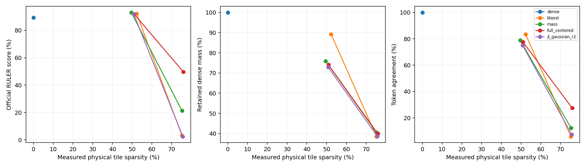
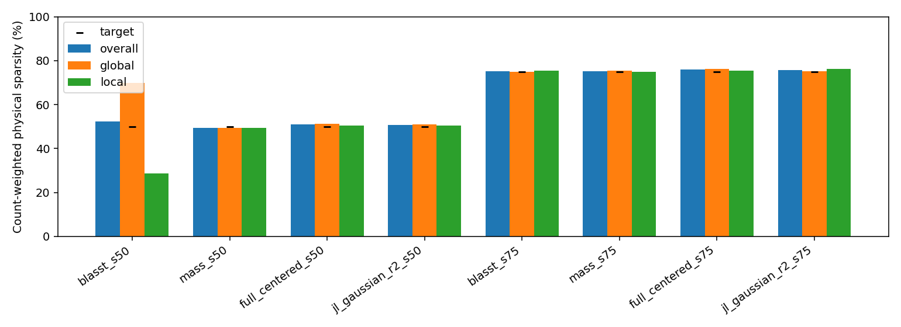

# DiffusionGemma RULER8K: BLASST, mass-only and directional routing

Audited final generations: 1170/1170. Complete: True.

## Setup

130 evaluation questions:10 per task across the13 tasks in [SparseD, Table4](https://arxiv.org/pdf/2509.24014). Disjoint calibration26 (2/task), development13 (1/task). Cached650-example pool; deterministic SHA256 selection, split/generation seed42. The pool has been used previously: this is not fresh held-out confirmation. No final scores or sparsity select thresholds.

Pinned DiffusionGemma revision f7f5b7f5fa82ffc52addd066915886d497f5517b; BF16,128-query×64-KV tiles, prefix+canvas skippable, local window1024. Native256-token canvas and at most48 denoising steps; thinking disabled. Requested temperature0 is the existing sentinel for the native0.8→0.4 schedule, NOT greedy. Official per-task output budgets are retained;8K denotes the RULER generator total budget, not exactly8192 post-chat input tokens. Dense is computed once per sample and shared across comparisons. RULER uses its pinned official scorer, not NeMo reasoning grading.

| Task | Final / calibration | Output budget | Final prompt tokens (min–max) |
|---|---:|---:|---:|
|niah_single_1|10 /2|128|8063–8072|
|niah_single_2|10 /2|128|7470–8073|
|niah_single_3|10 /2|128|8066–8072|
|niah_multikey_1|10 /2|128|7466–8072|
|niah_multikey_2|10 /2|128|7484–8071|
|niah_multikey_3|10 /2|128|7950–8034|
|niah_multivalue|10 /2|128|8065–8072|
|niah_multiquery|10 /2|128|7468–8071|
|vt|10 /2|30|8139–8145|
|cwe|10 /2|120|7941–8071|
|fwe|10 /2|50|7169–8125|
|qa_1|10 /2|32|6284–8166|
|qa_2|10 /2|32|6299–8168|

## Operators and calibration

All numerical kernels/routing rules are reused unchanged. Conservative physical deletion requires every valid query row in a128×64 tile to vote skip. First-support tiles and threshold ties are retained; structural masks and GQA remain native; retained attention is ordinarily renormalized without compensation.

BLASST compares each block maximum with the running maximum over all previously seen blocks. The existing calibration fits log(λL)=log(α)+γs, applies its calibration-only monotonic correction, then verifies complete sparse trajectories. Effective λ=exp(log_scale)/actual valid KV length L, separately local/global. Both λ are capped at1 unless the joint constant-λ=1 calibration run misses the requested whole-model target. If a single layer type has a lower ceiling but the whole-model target is attainable, type-specific calibration goals redistribute the budget without unlocking λ>1.

Mass-only is the previous max-logit×valid-token-count mass-bound method, not exact block mass. Full-dimensional and Gaussian2 centered use attention-weighted means, the retained running output, and valid-KV RMS normalization. Gaussian2 uses frozen per-layer/native-KV-head matrices, seed1729, FP32 projection/routing; original V forms model outputs. Dense calibration-state CDF proposals and the existing independent local/global rank/scalar refinement are verified within2pp, up to16 joint points. All policies freeze before sparse final evaluation.

| Method / target | Local threshold | Global threshold | Calibration whole/global/local (%) | λ>1 allowed |
|---|---|---|---|---|
|blasst /50%|log_scale=7.169459|log_scale=8.303796|50.25/66.71/27.99|False|
|mass /50%|log τ=-0.02332687|log τ=-0.6547565|48.72/48.47/49.07|False|
|full_centered /50%|log τ=-1.080951|log τ=-3.958913|49.90/50.19/49.51|False|
|jl_gaussian_r2 /50%|log τ=-1.164066|log τ=-4.088618|49.39/49.35/49.44|False|
|blasst /75%|log_scale=10.09133|log_scale=8.511757|75.36/75.54/75.12|True|
|mass /75%|log τ=-0.001160622|log τ=-0.2654467|74.79/74.92/74.61|False|
|full_centered /75%|log τ=0.06372107|log τ=-2.973095|75.99/76.52/75.29|False|
|jl_gaussian_r2 /75%|log τ=0.1146842|log τ=-3.096866|75.71/75.42/76.11|False|

Joint λlocal=λglobal=1 calibration physical sparsity (whole/global/local): 60.18%/83.67%/28.42%.
- blasst_s50 local: observed λ 1–1; 0/13350 calls above1.
- blasst_s50 global: observed λ 0.479484–0.617611; 0/2670 calls above1.
- blasst_s75 local: observed λ 18.8686–18.8686; 135175/135175 calls above1.
- blasst_s75 global: observed λ 0.590324–0.760381; 0/27035 calls above1.

## Per-task official scores (%)

| Task |dense|blasst_s50|mass_s50|full_centered_s50|jl_gaussian_r2_s50|blasst_s75|mass_s75|full_centered_s75|jl_gaussian_r2_s75|
|---|---:|---:|---:|---:|---:|---:|---:|---:|---:|
|niah_single_1|100.00|100.00|100.00|100.00|100.00|0.00|50.00|80.00|0.00|
|niah_single_2|100.00|100.00|100.00|100.00|100.00|10.00|70.00|70.00|0.00|
|niah_single_3|100.00|100.00|100.00|100.00|100.00|0.00|60.00|40.00|0.00|
|niah_multikey_1|100.00|100.00|100.00|100.00|100.00|0.00|30.00|90.00|30.00|
|niah_multikey_2|100.00|100.00|100.00|100.00|100.00|0.00|10.00|80.00|0.00|
|niah_multikey_3|100.00|100.00|100.00|100.00|90.00|0.00|0.00|10.00|0.00|
|niah_multivalue|100.00|100.00|100.00|95.00|95.00|0.00|40.00|65.00|2.50|
|niah_multiquery|100.00|100.00|100.00|100.00|100.00|2.50|2.50|7.50|0.00|
|vt|0.00|40.00|30.00|40.00|40.00|10.00|4.00|36.00|0.00|
|cwe|100.00|99.00|100.00|100.00|100.00|0.00|0.00|22.00|0.00|
|fwe|100.00|100.00|100.00|100.00|100.00|0.00|10.00|36.67|0.00|
|qa_1|100.00|100.00|100.00|100.00|100.00|10.00|0.00|60.00|0.00|
|qa_2|60.00|60.00|80.00|60.00|70.00|10.00|0.00|50.00|0.00|

## Equal-task macro and physical sparsity

| Condition | n | Score | Δ dense (pp) | Paired95%CI (pp) | Whole | Global | Local | Mass | Agreement |
|---|---:|---:|---:|---|---:|---:|---:|---:|---:|
|dense|130|89.23|0.00|0.00 to 0.00|0.00|0.00|0.00|100.00|100.00|
|blasst_s50|130|92.23|3.00|0.69 to 5.38|52.27|69.81|28.67|89.25|83.49|
|mass_s50|130|93.08|3.85|1.54 to 6.92|49.55|49.55|49.55|75.86|78.86|
|full_centered_s50|130|91.92|2.69|0.38 to 5.38|50.93|51.35|50.36|74.11|77.57|
|jl_gaussian_r2_s50|130|91.92|2.69|-0.38 to 6.15|50.77|51.05|50.39|72.88|74.99|
|blasst_s75|130|3.27|-85.96|-89.23 to -82.31|75.19|75.02|75.43|38.55|5.82|
|mass_s75|130|21.27|-67.96|-73.65 to -62.12|75.23|75.49|74.90|40.53|12.40|
|full_centered_s75|130|49.78|-39.45|-46.31 to -32.81|75.89|76.26|75.40|39.92|27.36|
|jl_gaussian_r2_s75|130|2.50|-86.73|-90.00 to -83.65|75.64|75.20|76.24|38.67|7.24|

Sparsity is Σ skipped eligible physical tiles / Σ eligible physical tiles across samples/layers/heads/steps, never an unweighted average. RULER scores may give fractional credit for multiple answers. Official per-task scores are computed jointly before equal-task macro averaging. CIs use a paired task-stratified prompt bootstrap; small differences may remain inconclusive.

Dense attention mass and operator error use dense attention on each sparse call’s own QKV state; they do not reuse incompatible dense-generation states after trajectories diverge. A separate shared-QKV diagnostic uses one calibration source per layer at step0 and sampled later steps on layers0/5. Operator error aggregates sqrt(Σ||Os−Od||²/Σ||Od||²). Token agreement compares equal positions even after first divergence; missing/extra positions disagree.

## Actual-sparsity comparisons

| Candidate | Reference | Score Δ (pp) | Paired95%CI | Whole sparsity gap (pp) | All types within3pp |
|---|---|---:|---|---:|---|
|blasst_s50|mass_s50|-0.85|-3.23 to 1.54|2.72|False|
|blasst_s50|full_centered_s50|0.31|-2.69 to 3.46|1.34|False|
|blasst_s50|jl_gaussian_r2_s50|0.31|-2.77 to 3.46|1.50|False|
|mass_s50|full_centered_s50|1.15|-1.92 to 4.62|1.38|True|
|mass_s50|jl_gaussian_r2_s50|1.15|-1.92 to 4.62|1.22|True|
|full_centered_s50|jl_gaussian_r2_s50|0.00|-3.85 to 3.85|0.16|True|
|blasst_s75|mass_s75|-18.00|-23.85 to -12.31|0.04|True|
|blasst_s75|full_centered_s75|-46.51|-53.06 to -39.82|0.70|True|
|blasst_s75|jl_gaussian_r2_s75|0.77|-2.69 to 4.62|0.45|True|
|mass_s75|full_centered_s75|-28.51|-36.82 to -20.13|0.66|True|
|mass_s75|jl_gaussian_r2_s75|18.77|13.00 to 24.54|0.41|True|
|full_centered_s75|jl_gaussian_r2_s75|47.28|39.86 to 54.40|0.25|True|

Do not infer an algorithmic win from matching target labels alone; compare achieved whole/global/local budgets and paired uncertainty. Full-dimensional routing is an expensive reference, not a deployable winner. QK, block softmax, projections, diagnostic PV and original-V attention still incur work; reported physical deletion is not a measured hardware speedup. No comparison with FlashAttention latency is made.

## Failures and audit

Missing entries: 0. Violations: 0. Full details are preserved in audit.json and failures.jsonl, including unsuccessful calibration attempts. A completed claim requires1170 hash-checked outputs, complete shared diagnostics, matching settings, valid threshold provenance and independent raw-only report regeneration.

