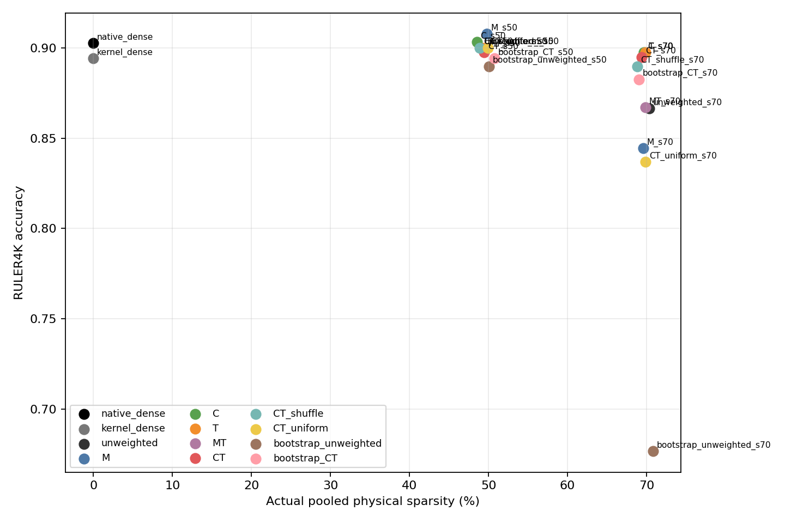
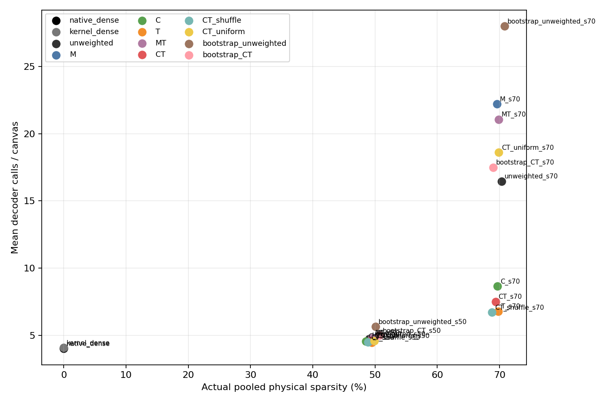
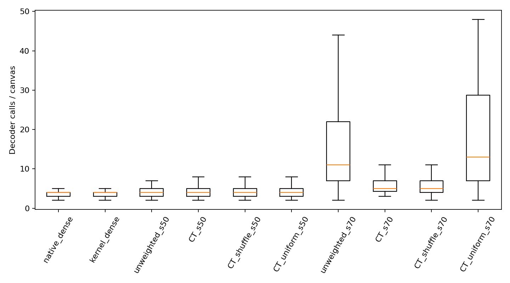
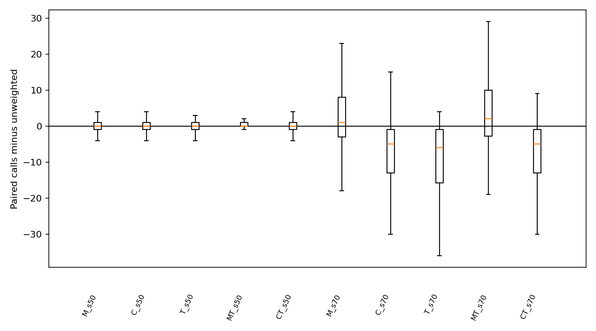
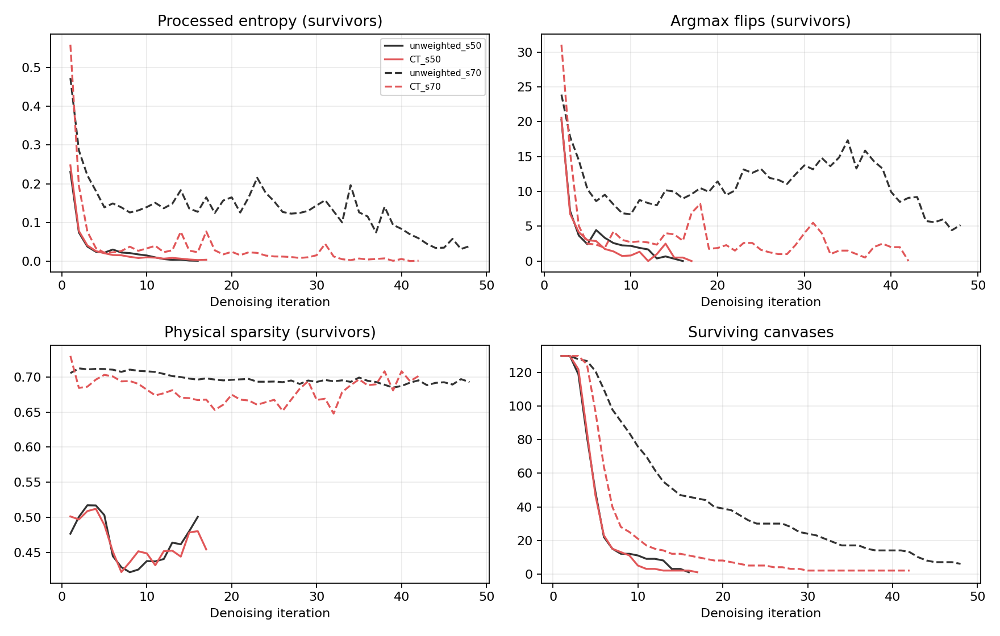
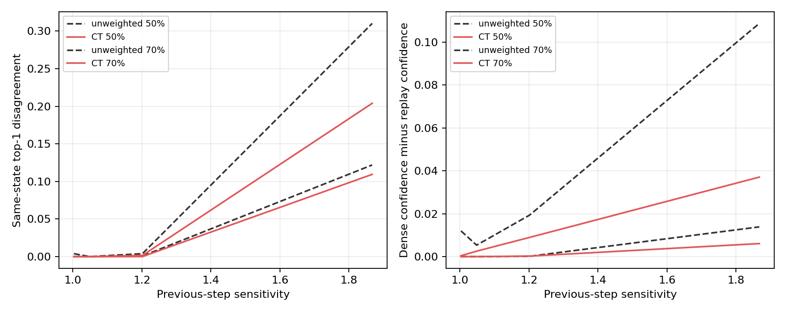

# Query-adaptive Gaussian-32 on RULER4K

Completed 2860/2860 example/condition runs. Complete.

130 previously examined prompts across 13 RULER4K tasks, 10 each; 26 disjoint task-balanced calibration prompts. BF16 DiffusionGemma-26B-A4B-it; native 256-token canvas, 48-step cap, reversible acceptance, native stopping and 0.8→0.4 temperature. H100 Gaussian-32 fixed projection seed 1729, FP32 routing, physical 128×64 tiles. All variants use their own previous-step logits; the first iteration is unweighted except the explicitly labeled shared dense bootstrap.
Selected tasks and counts: cwe (10), fwe (10), niah_multikey_1 (10), niah_multikey_2 (10), niah_multikey_3 (10), niah_multiquery (10), niah_multivalue (10), niah_single_1 (10), niah_single_2 (10), niah_single_3 (10), qa_1 (10), qa_2 (10), vt (10).

The router computes the original greedy online projected update `rho` and skips a physical tile only if `max_valid_rows(sensitivity_i × rho_iJ) < tau`. First-support tiles are retained; dropped tiles do not update the online softmax/projected/full-value state. Scores are not final dense-deletion errors. M/C/T/MT/CT use beta=3 and gamma=0.5; calibrated local/global thresholds are shared across layers/heads.
M uses the preceding raw top-two logit gap; C uses `sqrt(1−processed top-1 probability)`; T uses an EMA of deterministic top-1 flips; MT and CT are geometric means of their factors. The first iteration has sensitivity one. Shuffled CT breaks row identity within each 128-query tile; uniform CT preserves step-level strength without row allocation. Both are separately calibrated.

Physical sparsity is pooled skipped/eligible tiles over **all executed decoder calls**. Prefix encoding is excluded. Executed tiles = eligible−skipped counts retained PV tiles, not total QK/PZ work or runtime.

| Method | Bootstrap | Target | Actual overall/G/L | log τ local/global | Accuracy | Δ vs unweighted | Total calls | Mean/p90 calls | Cap | Executed tiles |
|---|---:|---:|---:|---:|---:|---:|---:|---:|---:|---:|
| native_dense | no | — | 0.0%/0.0%/0.0% | — | 90.3% | — | 520 | 4.00/6 | 0.0% | 0 |
| kernel_dense | no | — | 0.0%/0.0%/0.0% | — | 89.4% | — | 530 | 4.08/6 | 0.0% | 13,344,640 |
| unweighted_s50 | no | 50% | 49.0%/48.8%/49.2% | -1.110/-3.237 | 90.0% | +0.0% | 615 | 4.73/7 | 0.0% | 7,883,191 |
| M_s50 | no | 50% | 49.8%/50.1%/49.6% | -0.310/-2.437 | 90.8% | +0.8% | 625 | 4.81/7 | 0.0% | 7,888,869 |
| C_s50 | no | 50% | 48.5%/48.6%/48.4% | -1.010/-3.137 | 90.3% | +0.3% | 593 | 4.56/8 | 0.0% | 7,682,910 |
| T_s50 | no | 50% | 49.5%/49.8%/49.4% | -1.010/-3.137 | 90.0% | +0.0% | 579 | 4.45/6 | 0.0% | 7,350,583 |
| MT_s50 | no | 50% | 49.5%/49.8%/49.3% | -0.660/-2.787 | 89.9% | -0.1% | 625 | 4.81/7 | 0.0% | 7,943,827 |
| CT_s50 | no | 50% | 49.4%/49.6%/49.4% | -1.010/-3.137 | 89.7% | -0.3% | 596 | 4.58/7 | 0.0% | 7,579,835 |
| CT_shuffle_s50 | no | 50% | 48.9%/49.5%/48.5% | -1.010/-3.137 | 90.0% | +0.0% | 583 | 4.48/6 | 0.0% | 7,503,437 |
| CT_uniform_s50 | no | 50% | 49.9%/50.1%/49.8% | -1.010/-3.137 | 90.0% | +0.0% | 597 | 4.59/7 | 0.0% | 7,527,842 |
| bootstrap_unweighted_s50 | yes | 50% | 50.1%/49.5%/50.4% | -0.579/-2.705 | 89.0% | -1.0% | 732 | 5.63/10 | 0.0% | 9,212,379 |
| bootstrap_CT_s50 | yes | 50% | 50.7%/50.7%/50.7% | -0.360/-2.487 | 89.4% | -0.6% | 647 | 4.98/8 | 0.0% | 8,027,784 |
| unweighted_s70 | no | 70% | 70.3%/71.4%/69.6% | -0.184/-2.241 | 86.6% | +0.0% | 2139 | 16.45/41 | 4.6% | 15,976,294 |
| M_s70 | no | 70% | 69.6%/71.5%/68.3% | 0.966/-1.091 | 84.4% | -2.2% | 2887 | 22.21/48 | 21.5% | 22,031,358 |
| C_s70 | no | 70% | 69.7%/70.3%/69.3% | 0.003/-2.053 | 89.7% | +3.1% | 1124 | 8.65/17 | 0.8% | 8,585,908 |
| T_s70 | no | 70% | 69.8%/70.9%/69.1% | -0.084/-2.141 | 89.7% | +3.1% | 882 | 6.78/9 | 0.0% | 6,710,415 |
| MT_s70 | no | 70% | 69.9%/68.1%/71.0% | 0.659/-1.725 | 86.7% | +0.1% | 2737 | 21.05/48 | 12.3% | 20,770,094 |
| CT_s70 | no | 70% | 69.4%/70.1%/68.9% | -0.084/-2.141 | 89.5% | +2.8% | 974 | 7.49/13 | 0.0% | 7,503,139 |
| CT_shuffle_s70 | no | 70% | 68.8%/70.1%/68.0% | -0.084/-2.141 | 89.0% | +2.3% | 870 | 6.69/11 | 0.0% | 6,815,515 |
| CT_uniform_s70 | no | 70% | 69.9%/70.8%/69.2% | -0.084/-2.141 | 83.7% | -3.0% | 2418 | 18.60/42 | 7.7% | 18,403,579 |
| bootstrap_unweighted_s70 | yes | 70% | 70.8%/72.0%/70.0% | -0.047/-2.103 | 67.7% | -19.0% | 3639 | 27.99/48 | 33.1% | 26,849,169 |
| bootstrap_CT_s70 | yes | 70% | 69.0%/70.2%/68.2% | 0.216/-1.841 | 88.3% | +1.6% | 2273 | 17.48/41 | 8.5% | 17,694,773 |

### Per-task accuracy (selected matched-kernel comparisons)

| Task | kernel_dense | unweighted_s50 | CT_s50 | unweighted_s70 | CT_s70 |
|---|---:|---:|---:|---:|---:|
| cwe | 99.0% | 100.0% | 100.0% | 93.0% | 100.0% |
| fwe | 93.3% | 100.0% | 96.7% | 93.3% | 93.3% |
| niah_multikey_1 | 100.0% | 100.0% | 100.0% | 100.0% | 100.0% |
| niah_multikey_2 | 100.0% | 100.0% | 100.0% | 100.0% | 100.0% |
| niah_multikey_3 | 100.0% | 100.0% | 100.0% | 90.0% | 100.0% |
| niah_multiquery | 100.0% | 100.0% | 100.0% | 100.0% | 100.0% |
| niah_multivalue | 100.0% | 100.0% | 100.0% | 100.0% | 100.0% |
| niah_single_1 | 100.0% | 100.0% | 100.0% | 100.0% | 100.0% |
| niah_single_2 | 100.0% | 100.0% | 100.0% | 100.0% | 100.0% |
| niah_single_3 | 100.0% | 100.0% | 100.0% | 100.0% | 100.0% |
| qa_1 | 90.0% | 90.0% | 90.0% | 80.0% | 90.0% |
| qa_2 | 80.0% | 80.0% | 80.0% | 70.0% | 80.0% |
| vt | 0.0% | 0.0% | 0.0% | 0.0% | 0.0% |

Paired task-stratified prompt-bootstrap intervals are in `comparisons.csv`. These samples are reused development examples, not a fresh held-out confirmation. Accuracy comparisons at mismatched achieved global/local sparsity are descriptive, not matched-budget claims.

## Thresholds and numerical controls

Median positive unscaled calibration margin m_ref = 14.258; beta=3.0, gamma=0.5.
Local/global log-thresholds are frozen in `configs/thresholds/`. All target misses remain labeled as such.
Calibration allocation misses (>2 pp in at least one stratum): CT_shuffle_s70 (69.4% overall, 71.5% global, 68.0% local), bootstrap_unweighted_s70 (70.6% overall, 72.2% global, 69.5% local).
Two-example instrumentation and unit-weight parity passed. Archived backend parity: 3/6.

Native dense uses the original SDPA backend. Unpruned/weighted runs use the matched H100 kernel and its local-mask convention; therefore native-vs-kernel differences are not attributable to sparsity alone.

### Historical BLASST context (not a v4 matched-backend control)

| Archived path | Overall/G/L sparsity | Accuracy | Total calls | Interpretation |
|---|---:|---:|---:|---|
| blasst_capped | 46.0%/72.9%/28.4% | 88.9% | 546 | Custom compatible online-max implementation with λ≤1; sparsity is not matched to 70%. |
| kernel_blasst | 69.7%/69.9%/69.6% | 82.5% | 3619 | Custom aggressive λ>1 extension, matched near 70% in the old v3 backend. |
Both rows use the archived v3 binary. The v4 unit-weight and unpruned controls are rerun here because a one-quantum BF16 numerical difference can change stochastic trajectories; these BLASST rows are context only.

## Plots

## Timing

Instrumented final-run wall times are **not** production timing. Separate uninstrumented, interleaved timing is required before any speed claim.

## Conclusions and next test

At 50%, the best descriptive matched-allocation point is M_s50: accuracy 90.8% vs 90.0%, mean calls 4.81 vs 4.73. Use paired intervals before calling this a real gain.
At 70%, the best descriptive matched-allocation point is T_s70: accuracy 89.7% vs 86.6%, mean calls 6.78 vs 16.45. Use paired intervals before calling this a real gain.
Strict matched-budget joint-improvement test (both paired 95% intervals favorable): T_s70, CT_s70.
Descriptive matched-budget joint-improvement points (intervals may cross zero): C_s50, C_s70, T_s70, CT_s70.

### Allocation controls and target matching

CT_s50 vs CT_shuffle_s50: accuracy -0.3% [-0.8%, +0.0%], mean calls +0.10 [-0.15, +0.35]; matched overall/global/local within 2 pp.
CT_s50 vs CT_uniform_s50: accuracy -0.3% [-0.8%, +0.0%], mean calls -0.01 [-0.21, +0.22]; matched overall/global/local within 2 pp.
bootstrap_CT_s50 vs bootstrap_unweighted_s50: accuracy +0.4% [-0.8%, +2.2%], mean calls -0.65 [-1.20, -0.18]; matched overall/global/local within 2 pp.
CT_s70 vs CT_shuffle_s70: accuracy +0.5% [-1.0%, +2.3%], mean calls +0.80 [-0.02, +1.72]; matched overall/global/local within 2 pp.
CT_s70 vs CT_uniform_s70: accuracy +5.8% [+2.4%, +9.5%], mean calls -11.11 [-12.82, -9.43]; matched overall/global/local within 2 pp.
bootstrap_CT_s70 vs bootstrap_unweighted_s70: accuracy +20.6% [+14.9%, +26.3%], mean calls -10.51 [-12.46, -8.54]; matched overall/global/local within 2 pp.
Target/allocation miss: CT_shuffle_s70 achieved 68.8% overall, 70.1% global, 68.0% local, not all within 2 pp of 70%.

## Separate uninstrumented timing

| Condition | E2E s/example | Prefix encoder s/example | Decoder s/example | Sensitivity update s/example | Mean calls | Native dense / method |
|---|---:|---:|---:|---:|---:|---:|
| native_dense | 0.584 | 0.233 | 0.228 | 0.0001 | 4.00 | 1.000× |
| kernel_dense | 0.616 | 0.233 | 0.264 | 0.0001 | 4.08 | 0.947× |
| unweighted_s50 | 0.670 | 0.233 | 0.368 | 0.0001 | 4.73 | 0.871× |
| CT_s50 | 0.663 | 0.233 | 0.336 | 0.0085 | 4.58 | 0.880× |
| unweighted_s70 | 1.560 | 0.233 | 1.386 | 0.0003 | 16.45 | 0.374× |
| CT_s70 | 0.879 | 0.233 | 0.730 | 0.0186 | 7.49 | 0.664× |
| T_s50 | 0.650 | 0.233 | 0.282 | 0.0071 | 4.45 | 0.898× |
| T_s70 | 0.840 | 0.233 | 0.459 | 0.0117 | 6.78 | 0.695× |
Synchronized E2E wall time covers all 130 prompts, with two interleaved repeats per condition. Decoder, prefix-encoder and sensitivity-update CUDA events come from a separate matched one-prompt-per-task subset (13 prompts per repeat), with exact output/step parity checks. These measurements have different sample populations and must not be subtracted to infer a fixed overhead; other CPU work remains unattributed.

## Same-state diagnostic replay

13 task-balanced prompts, 25 saved decoder states. Matched-kernel dense, unweighted and CT replays use the identical current canvas, self-conditioning and prefix cache. Extra forwards are diagnostic overhead, excluded from timing and generation-call counts. Raw per-position damage, acceptance-set changes, tile-mask changes and sampled attention-output errors are in `diagnostic_replays/`.

The plotted rows are repeated correlated positions within a small diagnostic cohort, not independent accuracy trials.

| Replay method | Top-1 disagreement | Acceptance-set disagreement | Answer / outside disagreement | Mixed-query tiles |
|---|---:|---:|---:|---:|
| unweighted_s50 | 2.5% | 3.2% | 12.2% / 0.4% | 0 |
| CT_s50 | 2.2% | 2.9% | 11.9% / 0.1% | 0 |
| unweighted_s70 | 6.4% | 36.3% | 34.0% / 0.5% | 788 |
| CT_s70 | 4.1% | 15.5% | 21.4% / 0.4% | 902 |
The FP32 row-reference mask mismatch count in `diagnostic_replays/analysis.json` bounds how literally to interpret row-vote counts.

## Additional generation seeds

Seeds 43 and 44 reuse the same prompts and frozen thresholds; they probe sampling sensitivity, not fresh-data generalization.

| Seed | Condition | Accuracy | Mean calls | Actual/G/L sparsity |
|---:|---|---:|---:|---:|
| 43 | unweighted_s70 | 86.3% | 16.36 | 70.3%/71.3%/69.6% |
| 43 | T_s70 | 89.0% | 7.15 | 69.5%/70.4%/68.9% |
| 44 | unweighted_s70 | 84.8% | 16.16 | 70.3%/71.5%/69.6% |
| 44 | T_s70 | 90.5% | 7.26 | 69.7%/70.7%/69.0% |

## Supported conclusions, limitations, and next experiment

At ~50% physical sparsity there is no robust joint accuracy-and-iteration gain: T changes mean calls from 4.73 to 4.45 without changing measured accuracy (90.0% in both arms); the paired call interval crosses zero. M has a small accuracy increase but more calls, and CT does not beat its shuffled control.
At ~70%, T is the strongest matched-allocation result: accuracy 86.6%→89.7%, mean calls 16.45→6.78, and retained PV tiles 15,976,294→6,710,415. Both paired task-stratified bootstrap intervals favor T, and seeds 43/44 show the same direction on reused prompts. The ~0.5 percentage-point residual overall/global/local sparsity difference may explain some, but is unlikely to explain the full call-count change by itself; this last clause is an inference, not a controlled causal estimate.
T has no informative flip history until iteration 3. Its first two physical sparsities are 73.0%/73.4%, versus 70.6%/71.2% for static G32; at iteration 3 they are 69.5% versus 71.1%. Thus the gain is not a dense-first-step effect, but it includes different temporal allocation and calibrated thresholds as well as query weights.
CT does not establish that precise within-tile query identity is the cause: at ~70%, CT is 89.5% with 7.49 calls, while within-tile shuffled CT is 89.0% with 6.69 calls at slightly lower actual sparsity. Its paired accuracy interval includes zero and shuffled CT is not slower. Uniform-step CT performs much worse, so nonuniformity matters in some form, but a row-specific allocation benefit remains unproven. T lacks its own shuffled/uniform allocation controls.
Dense-first-1 is not a general remedy at 70% overall sparsity: the first dense call forces the remaining calls to prune much harder. Bootstrap CT improves substantially over bootstrap unweighted yet remains slower and less accurate than plain T/CT. No arm forced extra calls or changed native stopping.
On 25 same-input snapshots, the unweighted router's high-CT-sensitivity positions disagree with matched dense on top-1 12.6% of the time versus 0.3% for low-sensitivity positions; CT lowers overall disagreement 6.4%→4.1% and acceptance disagreement 36.3%→15.5%. These are correlated diagnostic positions and CT also retains slightly more physical tiles, so this supports proxy relevance but does not isolate the causal effect of row identity. Fixed-temperature mean top-1 confidence increases from 0.940 to 0.962 on the same states; this difference is not merely temperature annealing. Mixed row-vote tiles and answer/outside disagreement are tabulated above; native stopping still evaluates the full canvas.
The algorithmic recovery does not yet give positive H100 end-to-end speedup: T70 takes 0.840 s/example against native dense 0.584 s/example (0.695× native-dense/method), although it is 1.86× faster than static G32 at 70%. Its extra QK/PZ work and ~6.8 versus 4.0 calls remain; retained-tile counts are not hardware speedup.

A nominal target is not a matched physical sparsity point when actual overall or local/global allocations differ. The archived BLASST numbers are not v4 matched-backend controls. This repeatedly examined 130-question cohort is exploratory, and small score differences are not equivalence evidence.

Recommended next experiment: freeze T70 and compare it against within-tile-shuffled T and uniform-step T at matched actual overall/global/local sparsity on fresh task-balanced prompts. This directly tests query-identity rather than temporal-allocation benefits. If that benefit survives, separately tackle the measured QK/PZ and remaining-iteration costs before claiming an end-to-end speedup; no kernel or stopping-rule redesign was made here.
